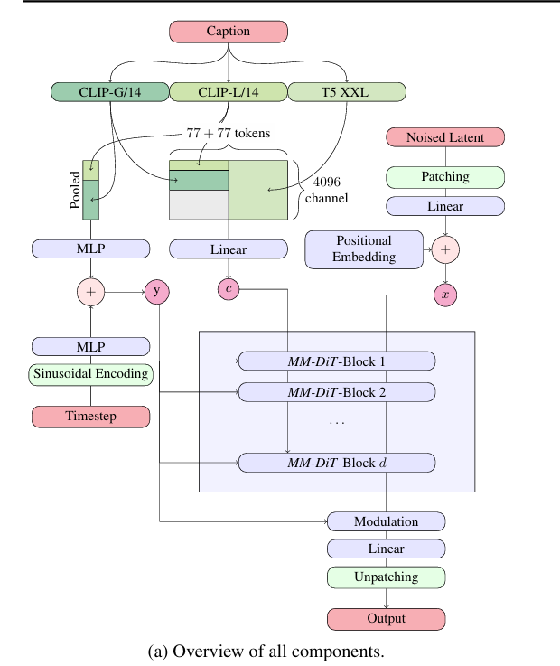
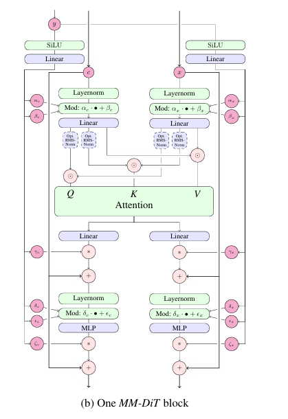
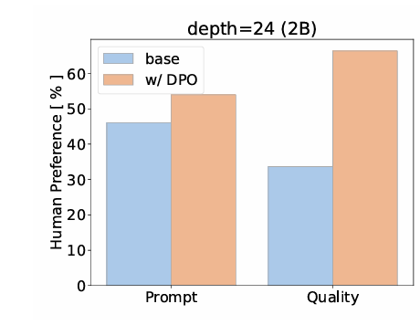

# Stable Diffusion 3.5

## 1. Stable Diffusion 3.5 분석 
### 1.1. 모델 비교 

| 모델 (Model) | 파라미터 수 (Parameters) | VRAM 요구량 (권장) | 아키텍처 (Architecture) | 비고 |
| :--- | :--- | :--- | :--- | :--- |
| SD v1.5 | ~0.98B (U-Net) | ~4-6 GB | CNN (U-Net) | 현재 V4에서 사용 중. 가볍지만 디테일 묘사에 한계. |
| SD 3.5 Medium | 2.5B | ~9-12 GB | MMDiT (Transformer) | 밸런스형. 소비자용 GPU에서 구동 용이. 1.5 대비 약 2.5배 큼. |
| SD 3.5 Large | 8.1B | ~16-24 GB | MMDiT (Transformer) | 전문가용. VRAM 소모가 매우 큼 (FP8 양자화 시 ~11GB 가능). |

### 논문 분석
본 논문은 Stable Diffusion 3 계열 중 **SD 3.5**에 해당하는 핵심 기술을 설명한다.

*   **Rectified Flow (RF)**:
    1.  **왜 '직선'인가? (기존 모델과의 차이)**:
        *   기존 확산 모델(SD1.5/DDPM)은 노이즈 제거 과정이 구불구불한 곡선 경로를 따르므로, 경로 이탈을 막기 위해 수백~수천 단계의 미세한 이동이 필요했습니다.
        *   **RF**는 데이터($x_0$)와 노이즈($\epsilon$)를 **최단 거리인 직선**으로 연결합니다. 방향이 일정하므로 오차가 적고, 적은 단계(Step)로도 고품질 생성이 가능합니다.

    2.  **수식의 의미 $z_t = (1-t)x_0 + t\epsilon$**:
        *   이미지($x_0$)와 노이즈($\epsilon$)를 시간 $t$에 따라 선형적으로 섞는 설계도입니다.
        *   $t=0 \rightarrow x_0$ (이미지), $t=1 \rightarrow \epsilon$ (노이즈)
        *   중간 단계는 두 상태가 **선형적(Linear)**으로 혼합된 상태이며, 시간이 흐를수록 노이즈가 '일정한 속도'로 걷어집니다.
    3.  **학습 목표 (Velocity 예측)**:
        *   MM-DiT 블록은 직선 위를 이동하기 위한 **'속도(Velocity, $v_{\Theta}$)'**를 학습합니다.
        *   현재 위치($z_t$)와 텍스트($c$)를 보고, "직선 경로를 유지하려면 어느 방향으로 얼마만큼 가야 하는가?"를 계산합니다.
        *   **Logit-Normal Sampling**: 시각적으로 중요한 중간 타임스텝을 집중적으로 학습하여 예측 정확도를 높였습니다.

*   **MMDiT (Multimodal Diffusion Transformer)**:
    *   텍스트와 이미지를 위한 별도의 가중치를 가지면서도, 양방향으로 정보가 흐르는 Transformer 구조

#### 분석 

1.  **하이브리드 입력 구조 (Hybrid Input Structure)**: 텍스트와 이미지

2.  **텍스트 처리 (Text Processing)**:
    *   **Pooled 정보의 처리 (Global Context Modulation, $y$)**:
        *   **Concatenation**: CLIP-L/14(768차원)와 OpenCLIP bigG/14(1280차원)의 Pooled 출력을 합쳐 2048차원 벡터($c_{vec}$)를 생성
        *   **MLP의 역할**: 이 벡터는 MLP를 거쳐 이미지의 **Global Context** 정보로 변환
        *   **결과물 $y$**: Timestep 정보와 결합되어 최종적으로 $y$가 되며, 이는 MM-DiT 블록 전체에 주입되어 생성의 가이드라인(Modulation) 역할을 합니다
    *   **시퀀스 정보의 통합 (Context Encoding, $c$)**:
        *   **구성 (Composition)**: CLIP-L/14, OpenCLIP bigG/14 (각 77 토큰)와 T5 XXL (4096 채널)의 시퀀스 정보를 결합
        *   **기능적 역할**: CLIP 모델들은 전반적인 스타일과 사물을, T5 모델은 복잡한 문장 구조와 객체 간 관계를 파악하여 고차원 정보를 제공
        *   **Linear Layer**: 각기 다른 차원의 출력을 MM-DiT가 처리 가능한 공통 차원으로 정렬(Projection)
        *   **결과물 $c$**: $y$가 전체적인 분위기(Global)를 담당한다면, $c$는 MM-DiT 블록 내부로 주입되어 이미지 패치($x$)와 직접 상호작용하며 세밀한 디테일을 제어

3.  **이미지 처리 (Image Processing)**:
    *   **Latent Image Tokenization ($x$)**:
        *   **Noised Latent Input**: Latent Space 상의 노이즈가 포함된 입력
        *   **Patching & Flattening**: $2 \times 2$ 패치 단위로 분할(Patching) 후 Flattening하여 2D 이미지를 1D 시퀀스로 변환
        *   **Linear Projection & Positional Embedding**: 텍스트 임베딩($c$)과 차원을 일치시키기 위한 선형 투영(Linear Projection)을 수행하고, 각 패치의 공간적 위치 정보를 보존하기 위해 Positional Embedding을 수행
        *   **Latent Token Generation ($x$)**: 최종적으로 생성된 $x$는 MM-DiT 블록의 입력으로 사용되어, 텍스트 컨텍스트($c$)와 Joint Attention을 수행

4. **효과**: 이미지와 텍스트라는 다른 데이터를 동등한 Sequence Token으로 변환하여, Multimodal Transformer 내에서 서로 상호작용할 수 있도록 합니다

**MM-DiT Block Mechanics**:
    

- **Separate Weights**:

    구조: 블록 내부가 왼쪽(텍스트 $c$)과 오른쪽(이미지 $x$)으로 완전히 나뉘어 있는 구조

    이유: 텍스트와 이미지(공간/픽셀)의 데이터 성격이 다르기 때문에, 각각 **전용 가중치(Separate Weights)**를 가진 독립적인 트랜스포머처럼 작동하여 각자의 개별적인 특징을 최적화

- **Joint Attention**:

    작동 방식: 각자 작동하던 텍스트와 이미지 시퀀스가 중앙의 Attention 단계에서 하나로 합쳐져 연산

    효과: 이 과정에서 **Bidirectional Flow**이 발생하여, 이미지는 프롬프트의 지시를 반영하고 텍스트는 이미지의 구도를 이해 ("머리 색", "글자 철자" 등의 세부 제어가 여기서 결정)

- **Modulation ($y$의 개입)**:

    $y$(Pooled CLIP + Timestep)는 한 블록당 총 6번 개입하여 데이터를 조절

| 파라미터 | 개입 지점 | 역할 |
| :--- | :--- | :--- |
| $\alpha_c, \beta_c$ | Attention 전 (텍스트) | 텍스트 데이터를 현재 Timestep에 맞게 스케일링/오프셋 조절 |
| $\alpha_x, \beta_x$ | Attention 전 (이미지) | 이미지 패치를 현재 노이즈 상태에 맞춰 최적화 |
| $\gamma_c, \gamma_x$ | Attention 후 | 섞인 정보 중 얼마나 많은 양을 결과에 반영할지 결정하는 게이트 |
| $\delta_c, \epsilon_c$ | MLP 전 (텍스트) | 고차원 특징 추출 전 데이터 규격 재정비 |
| $\delta_x, \epsilon_x$ | MLP 전 (이미지) | 이미지의 세부 시각 특징에 집중하도록 조절 |
| $\zeta_c, \zeta_x$ | 블록 최종 출력 | 다음 블록으로 넘기기 전 마지막으로 정보 강도 조절 |

- **안정성과 마무리**:

    *   **RMS-Norm**:  고해상도 학습 시 수치가 튀는 것을 막는 안전장치
    *   **Residual Connection**: 모든 연산 결과는 원래의 입력값($c, x$)에 더해지는 방식($+$)으로 처리되어, 층이 깊어져도 정보 유실을 방지

#### **GenEval 성능 비교**:
논문에서 제시한 GenEval 평가 결과, SD 3.5 Medium/Large 모델이 SD v1.5 대비 모든 지표(특히 위치 정확도 및 복합 객체 생성)에서 월등한 성능을 보입니다.

| 모델 (Model) | 전체 점수 (Overall) | 단일 객체 (Single) | 두 객체 (Two) | 수량 (Counting) | 색상 (Colors) | 위치 (Position) |
| :--- | :--- | :--- | :--- | :--- | :--- | :--- |
| SD v1.5 | 0.43 | 0.97 | 0.38 | 0.35 | 0.76 | 0.04 |
| SD 3.5 Medium (depth=24) | 0.62 | 0.98 | 0.74 | 0.63 | 0.67 | 0.34 |
| SD 3.5 Large (depth=38) | 0.68 | 0.98 | 0.84 | 0.66 | 0.74 | 0.40 |

> **각 지표의 의미**:
> *   **전체 점수 (Overall)**: 아래 모든 세부 지표의 평균적인 성능.
> *   **단일 객체 (Single)**: "A photo of a cat" 처럼 하나의 객체가 프롬프트대로 생성되었는지 여부.
> *   **두 객체 (Two)**: "A cat and a dog" 처럼 두 개의 다른 객체가 모두 생성되었는지 여부.
> *   **수량 (Counting)**: "Three apples" 처럼 지시한 개수가 정확히 맞는지 여부.
> *   **색상 (Colors)**: "A red car and a blue bike" 처럼 특정 객체에 색상이 올바르게 결합되었는지(Color Binding) 여부.
> *   **위치 (Position)**: "A cat left of a dog" 처럼 객체 간의 상대적 위치 관계가 지켜졌는지 여부.

### 1.3. MMDiT 구조 및 캡션 전략이 헤어 컬러 제어에 미치는 영향(현재 프로젝트와의 연결)

SD 3.5 Medium의 'Colors' 점수 하락(0.76 $\rightarrow$ 0.67)은 성능 저하가 아닌, **학습 전략 변화에 따른 trade-off**입니다. 대신 **색상 할당(Color Attribution)** 능력은 상승했습니다.

#### 1.3.1. 단순 색상(Colors) 점수 하락의 원인: 합성 캡션
논문 5.2.2장 'Improved Captions'에 따르면, 학습에 VLM(Visual Language Model)이 생성한 합성 캡션을 도입했습니다.
*   **Concept Forgetting**: 합성 캡션을 사용하면서 모델이 VLM의 지식 체계에 없는 특정 개념을 잃는 현상이 발생하여, 'Colors' 점수가 일부 하락(71.54 $\rightarrow$ 68.09)하는 부작용이 관찰되었습니다.

#### 1.3.2.강점: 색상 할당 (Color Attribution)의 비약적 상승
"빨간색"을 만드는 능력(Colors)은 하락, "빨간색"을 **원하는 대상에 정확히 입히는 능력(Color Attribution)** 은 상승

| 모델 (Model) | Colors | Color Attribution |
| :--- | :--- | :--- |
| **SD v1.5** | 0.76 | **0.06** |
| **SD 3.5 Medium** | 0.67 | **0.36** |

*   **SD 1.5의 한계**: 색상은 잘 나오지만, 엉뚱한 곳(배경, 다른 객체 등)에 칠해지는 'Color Bleeding' 현상이 발생할 수 있다.
*   **SD 3.5 Medium의 강점**: 색상 점수는 낮아 보일지라도, **정확한 위치에 색을 입히는 능력은 6배 더 뛰어납니다.** 이는 헤어 컬러링 작업 시 원하는 위치에만 색을 칠할 수 있음을 의미합니다.

#### 1.3.3. DPO를 통한 성능 회복
논문에서는 이러한 초기 하락을 **DPO(Direct Preference Optimization)** 미세 조정을 통해 해결할 수 있음을 보여줍니다. (8B 모델 기준 Colors 점수가 0.89까지 상승)
따라서, 향후 Fine-tuning 단계에서 적절한 데이터셋을 사용하면 이 'Colors' 점수 또한 충분히 회복 가능합니다.

#### 1.4. Aesthetic Quality
논문은 DPO 파인튜닝이 샘플들을 **"aesthetically pleasing"** 만든다고 제시하고 있습니다. 이는 DPO가 인간이 직접 고른 "더 정확하고 보기 좋은 이미지"를 학습 데이터로 삼기 때문에, 모델이 색상과 객체 간의 관계를 더 명확히 이해하게 되기 때문입니다.

표: SD 3.5 Medium (depth=24) 모델의 DPO 적용 전후 인간 선호도 비교. DPO 적용 시 Prompt 준수도와 이미지 품질 모두에서 인간 선호도가 크게 상승함을 확인할 수 있다.

### 1.5. Conclusion
*   **선정 모델**: Stable Diffusion 3.5 Medium
*   **이유**:
    *   메모리 효율성 요구사항("Stable-diffusion medium version은 메모리를 적게 씀")에 부합.
    *   Large 모델(8.1B)은 학습 및 추론 시 고가의 H/W가 필요하여 접근성이 낮음.
    *   Medium(2.5B)은 현재 v1.5(1B)보다 크지만, 최신 아키텍처(MMDiT)를 통해 더 나은 텍스트 이해력과 이미지 품질을 제공함.
    *   **v1.5의 한계 극복**: MMDiT의 Joint Attention과 정확한 Color Attribution 능력을 통해, v1.5의 머리 색 제어 메커니즘의 한계을 극복할 수 있을 것으로 기대

## 2. 실험 결과 
(이곳에 실제 모델을 돌린 후 결과 이미지와 로그를 작성할 예정)

### 2.1. 변경된 파라미터 사이즈 확인
*   실제 파라미터 사이즈: [To be filled]
*   학습 메모리 사용량: [To be filled]

### 2.2. 생성 이미지 비교

| Prompt | SD 1.5 (V4) | SD 3.5 Medium (V4.3) |
| :--- | :--- | :--- |
| " ... " | (Image) | (Image) |
