# SketchHairSalon Image Generation Logic

이 문서는 SketchHairSalon 프로젝트의 이미지 생성 원리, 입력 데이터의 역할, 그리고 결과물에 대한 설명을 정리합니다.

## 1. 이미지 생성 원리

이 모델은 **Sketch-to-Image (스케치 기반 이미지 생성)** 방식을 사용하며, 핵심 아키텍처는 `UnetAtBgGenerator`입니다. 이 구조는 크게 두 가지 경로(Path)가 결합되어 작동합니다.

### A. Main UNet (머리카락 생성 경로)
*   **역할**: 스케치(구조)와 컬러 가이드를 바탕으로, 마스크 영역 내부에 **새로운 머리카락을 생성**합니다.
*   **입력**: `Sketch` + `Color Guide` + `Matte`
*   **특징**: `AttentionModule`을 사용하여 머릿결과 같은 미세한 디테일을 집중적으로 학습하고 생성합니다.

### B. BgEncoder (배경 보존 경로)
*   **역할**: 머리카락이 아닌 **얼굴과 배경 영역을 원본 그대로 보존**합니다.
*   **입력**: `Original Image` + `Matte` + `Noise`
*   **작동 방식**:
    *   `Matte`(마스크)를 사용하여 **머리카락 영역(1)**은 `Note`(노이즈)로 채우고, **비-머리카락 영역(0)**은 원본 이미지를 유지합니다.
    *   이 정보는 인코딩되어 생성기(Generator)의 디코더(Decoder) 단계마다 주입(`Feature Injection`)되어, 생성된 머리카락과 원본 얼굴/배경이 자연스럽게 합성되도록 돕습니다.

---

## 2. 입력 데이터 (Inputs)

모델은 다음 세 가지 주요 입력을 사용하여 이미지를 생성합니다.

| 입력 (Input) | 설명 및 역할 | 비고 |
| :--- | :--- | :--- |
| **input_1** | **Sketch (스케치)** | Canny Edge Detection 등을 통해 추출한 **머리카락의 구조(Structure) 정보**입니다. 머리카락의 흐름과 모양을 결정합니다. |
| **input_2** | **Color/Texture Guide (색상 가이드)** | **색상과 질감 정보**를 제공합니다. 원본 이미지에서 추출하지만, **얼굴은 유지하고 몸통/배경은 검은색으로 마스킹**하여 불필요한 색상 정보가 머리카락 생성에 간섭하지 않도록 처리합니다. |
| **Matte** | **Mask (마스크)** | 머리카락이 생성될 **영역을 정의**합니다. (0: 유지할 배경/얼굴, 1: 새로 생성할 머리카락 영역) |

---

## 3. 결과

*   **최종 출력**: 원본의 얼굴과 배경은 유지되면서, 스케치(`input_1`)와 색상 가이드(`input_2`)를 반영한 새로운 헤어스타일이 합성된 이미지입니다.
*   **특징**: 얼굴과 자연스럽게 블렌딩되며, `input_2`에서 몸통 색상을 제거함으로써 머리카락 아래로 불필요한 신체 부위가 복원되는 현상을 방지합니다.

*   **한계**: 이마라인을 살리지 못함.

---

각 단계별 이미지입니다.

| Original Image | input_1 (Sketch) | input_2 (Color Guide) | Generated Matte | Generated Result |
| :---: | :---: | :---: | :---: | :---: |
|  | 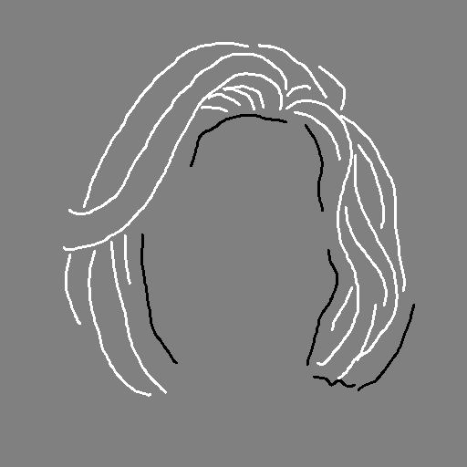 | 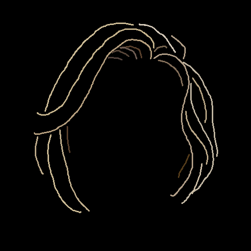 | 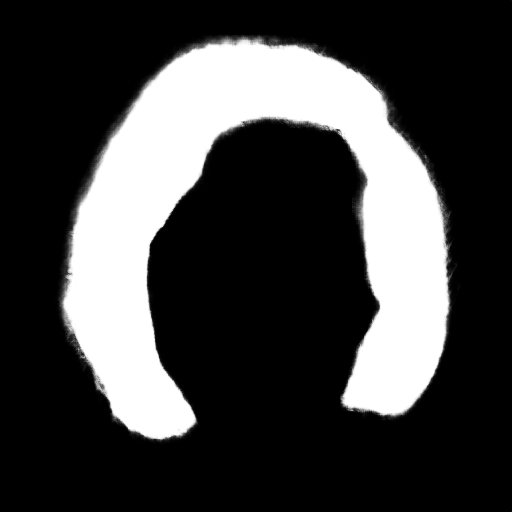 |  |
| 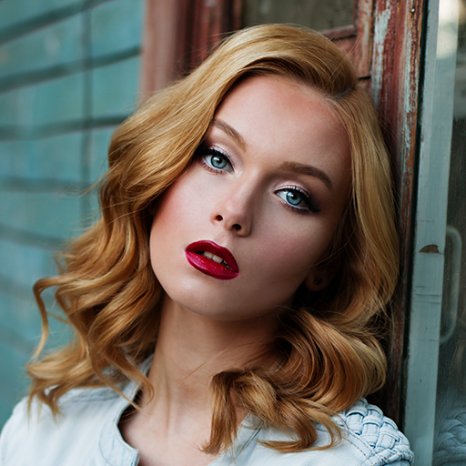 | 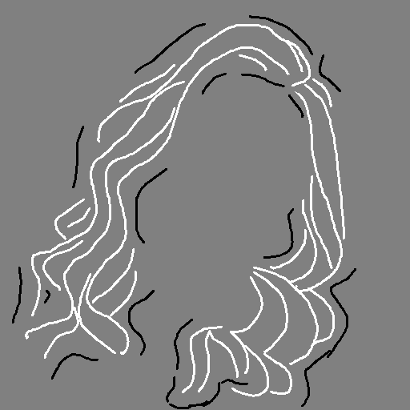 | 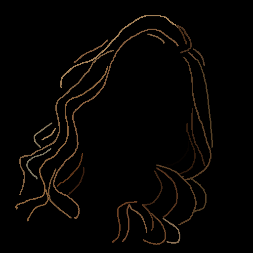 | 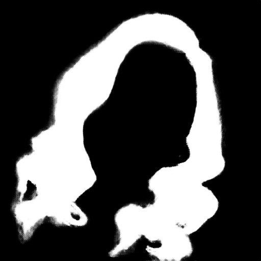 | 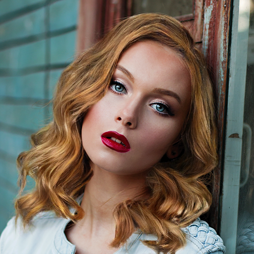 |
| 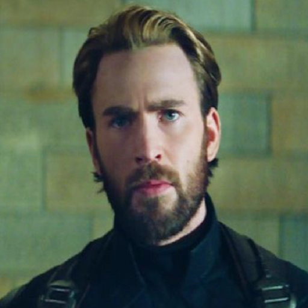 | 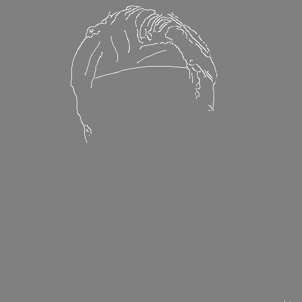 | 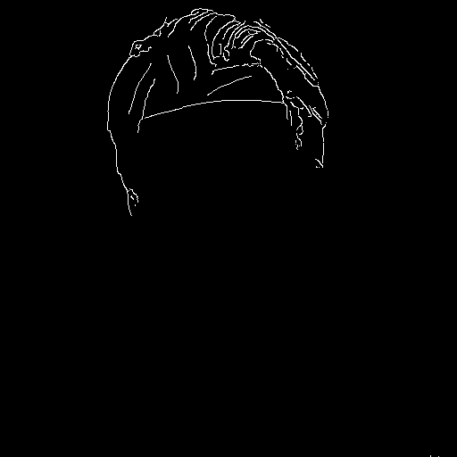 | 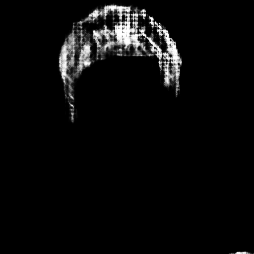 | 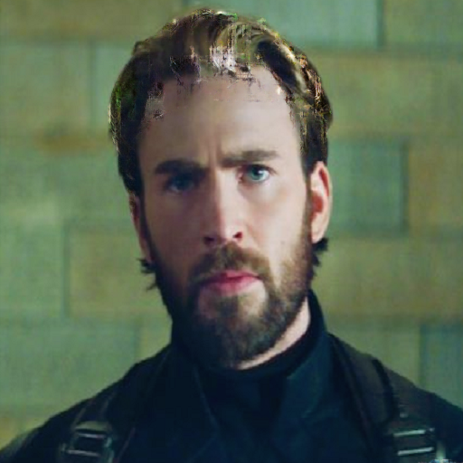 |

## 4. SD3.5 고도화 설계: Reference Attention

기존의 단순 Latent 교체 방식이 가진 **"경계 부자연스러움"**과 **"조명/텍스처 불일치"** 문제를 해결하기 위해, SD3.5 아키텍처(Transformer)에 최적화된 **Reference Attention** 기법을 도입합니다.

### A. 배경 (Why): Latent 교체의 한계
*   **문제점**: Latent Blending(마스크 밖 강제 교체)은 픽셀 값은 맞출 수 있으나, **경계 주변의 상호작용**을 만들어내지 못합니다.
*   **원인**: SD3.5와 같은 Transformer 모델은 전역 컨텍스트(Global Context)를 통해 전체 이미지를 해석합니다. 생성 도중 픽셀을 강제로 갈아끼우면, 모델 내부의 **일관된 해석 흐름이 끊겨** 머리카락이 배경 위에 '떠 있는' 듯한 이질감이 발생합니다.
*   **해결책**: "생성 중에" 모델이 배경을 참고하여 스스로 조명과 그림자를 맞추도록 **Reference Attention**을 적용해야 합니다.

### B. 핵심 매커니즘: Reference Attention
모델의 추론 과정(Self-Attention)에 원본 배경의 정보를 주입하는 방식입니다.

1.  **Background Pass (준비 단계)**
    *   **입력**: `Masked Image` (원본에서 머리카락 영역을 지운 이미지)
    *   **동작**: SD3.5를 한 번 통과시켜 각 `JointTransformerBlock`의 Self-Attention에서 **Key**와 **Value**를 추출하여 캐싱합니다.
2.  **Generation Pass (생성 단계)**
    *   **입력**: 노이즈 + 텍스트 프롬프트 + 컨트롤 조건.
    *   **동작**: Self-Attention 연산 시, 현재 생성 중인 토큰의 K, V에 캐싱해 둔 **배경 K, V를 연결(Concat)**하여 참조합니다.

### C. 구현 상세

#### 1. Attention 수정 (JointTransformerBlock)
`Self-Attention` 단계에서 Query(Q)는 그대로 두고, Key(K)와 Value(V)를 확장합니다.
*   `K_new = concat(K_gen, α * Gate * K_bg)`
*   `V_new = concat(V_gen, α * Gate * V_bg)`
    *   **α (Alpha)**: 참조 강도 (Reference Scale).
    *   **Gate**: 토큰별 적용 강도를 조절하는 마스크.

#### 2. 마스크 기반 게이팅
전체 영역에 동일하게 배경을 주입하면 머리카락 생성이 억제되거나 텍스처가 뭉개질 수 있습니다. 따라서 경계에만 집중하는 것이 핵심입니다.
*   **전략**:
    *   **경계 영역**: 배경의 조명/노이즈를 강하게 참조 (Gate High).
    *   **머리카락 내부**: 생성 자유도 보장 (Gate Low).
    *   **배경 내부**: 보존 (Gate 무관).
*   **Gate 수식 예시**:
    `Boundary = blur(Mask) - blur(blur(Mask))`
    `Gate = clamp(Boundary * gain, 0, 1)`

#### 3. 입력 데이터 전략
Background Pass에는 **Masked Image**를 사용하는 것이 유리합니다. 원본 이미지를 그대로 쓰면 KV 캐시에 "지워야 할 원본 머리카락" 정보가 섞여 들어와, 생성된 머리카락이 원본과 비슷해지는 간섭이 발생할 수 있습니다.

### D. 최종 파이프라인

1.  **Reference Attention (1차)**: 생성 과정에서 조명, 그림자, 노이즈 패턴의 물리적/광학적 일관성 확보.
2.  **Latent Blending (2차)**: 생성 후 배경 픽셀의 완벽한 보존을 보장하는 최후 방어막.
3.  **SONIC (3차)**: 초기 노이즈 제어를 통해 구조적/형태적 일관성 유지.

---

## 5. 심층 분석: TinyAdapter vs BgEncoder (Ref-Attention)

### A. 이마라인 제어 (Hairline Control - TinyAdapter)
*   **위치**: **입력층 (Entrance)**
*   **방식**: **Input Injection (덧셈)**
    *   코드 예시: `model_input = latent_model_input + adapter_input`
    *   노이즈(Latent)에 마스크 특징(Adapter)을 더해서 트랜스포머의 시작점에 입력합니다.
*   **역할**: "여기에 머리카락이 있어야 해"라는 **구조적 가이드(Geometry)**를 가장 처음에 강력하게 주입합니다.

### B. 배경 제어 (Background Control - Reference Attention)
*   **위치**: **중간층 (Internal Layers)**
*   **방식**: **Attention Modification (참조)**
    *   트랜스포머 내부의 수많은 Attention 블록 안에서 작동합니다.
*   **역할**: 머리카락을 그리는 도중(Generation Pass), 매 단계마다 원본 이미지(Background)를 Attention
    *   "이 위치의 피부 톤은 이 색이어야 하고, 조명은 저쪽에서 오네?"라는 **디테일 정보**를 가져옵니다.

### C. 결론 (Summary)
| 제어 대상 | 사용하는 모듈 | 개입 위치 |
| :--- | :--- | :--- |
| **이마라인 (형태)** | TinyAdapter | 입력층 |
| **배경 (질감/색)** | Ref-Attention | 중간층 |

결론적으로, **형태는 Adapter가 잡고, 질감은 Attention이 잡는 구조**입니다.