# 색상이 진해지는 현상 디버강

## 1. 프로세스 개요
생성 과정은 두 단계로 나뉩니다:

1.  **Phase 1: SONIC (시드 최적화)** 
    *   이 단계는 초기 노이즈(`init_noise`)를 원본 이미지의 아이덴티티와 일치시키도록 최적화합니다.
    *   **Step 000 이전**에 발생합니다.
    *   SONIC의 결과물은 다음 단계의 시작점이 됩니다.

2.  **Phase 2: 하이브리드 생성 (50 Steps)** - *아래 이미지 참조*
    *   표준적인 diffusion 디노이징 과정입니다 (Step 000에서 049까지).
    *   **Step 000**: 첫 번째 디노이징 단계 직후의 상태입니다. SONIC에 의해 설정된 초기 구조를 반영합니다.
    *   **어두워지는 현상(Darkening Issue)**: 단계가 진행될수록(예: Step 30+), 이미지가 어두워지거나 대비가 강해질 수 있습니다. 이는 중간 단계의 노이즈가 섞인 latents를 VAE로 디코딩할 때 다이내믹 레인지가 흔들리거나, 모델이 텍스처를 과도하게 포화시키면서 발생할 수 있습니다.

## 2. 선택된 중간 단계 (Selected Intermediate Steps)
진행 과정을 보여주는 대표적인 6개 단계입니다.

| Step | Image | Description |
| :---: | :---: | :--- |
| **000** | 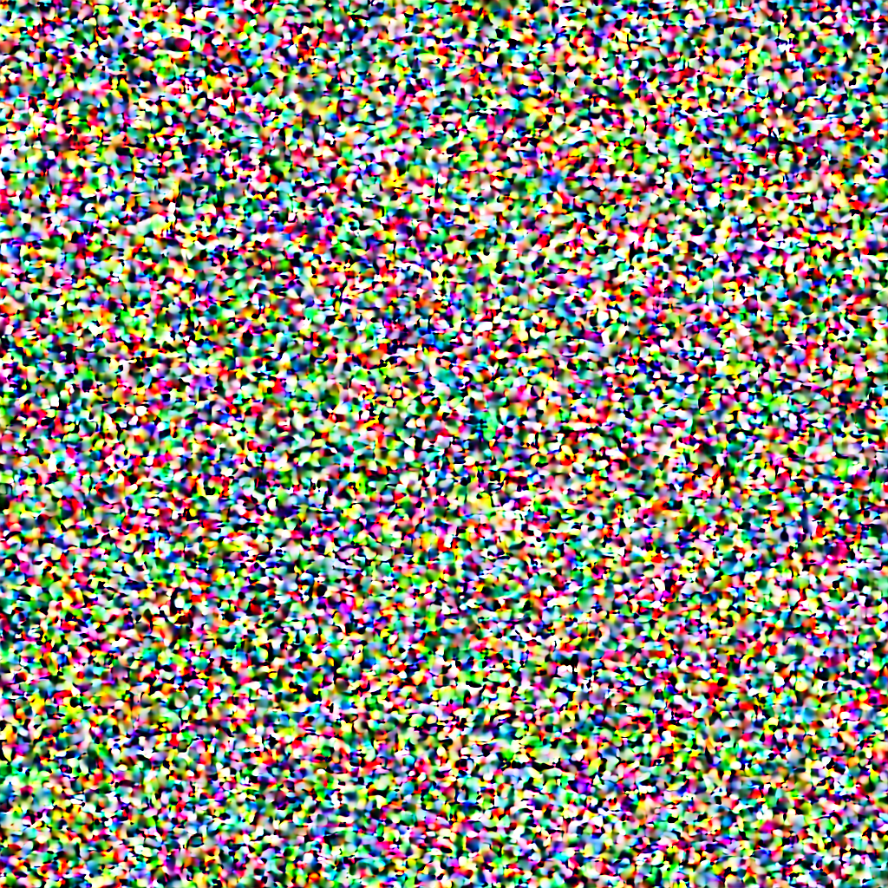 | **생성 시작**: SONIC 단계에서 넘어온 노이즈 구조를 보여줌 |
| **010** | 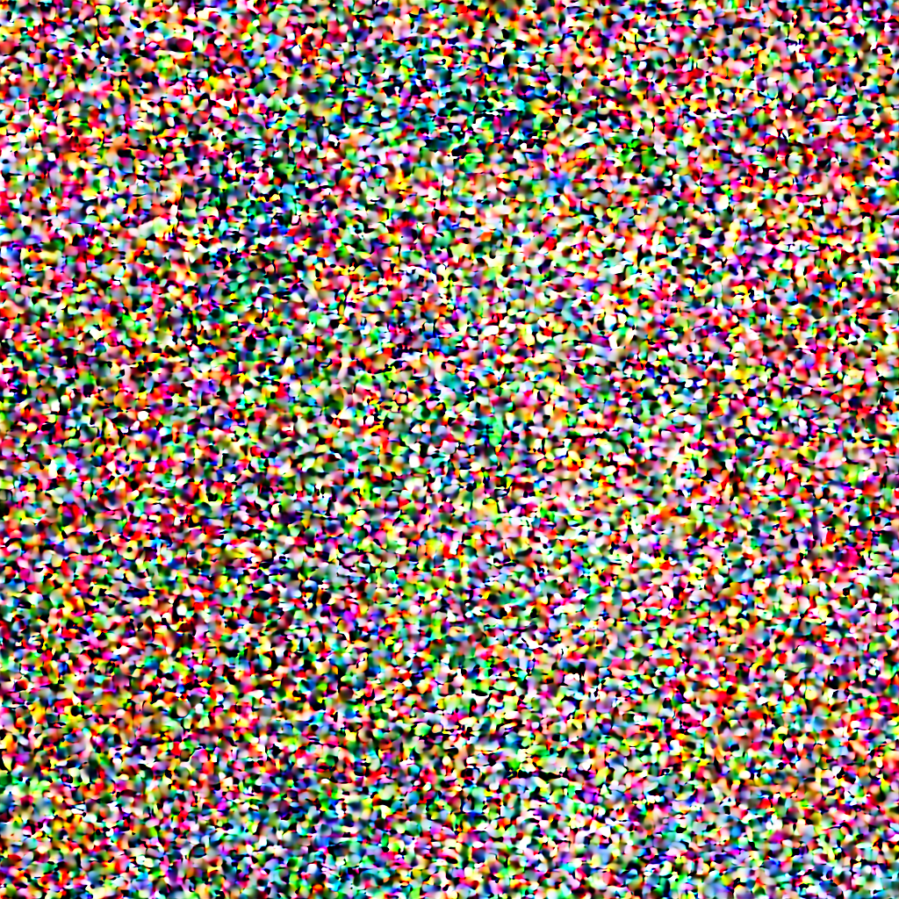 | **초기 구조**: 헤어의 형태가 드러나기 시작함. |
| **020** | 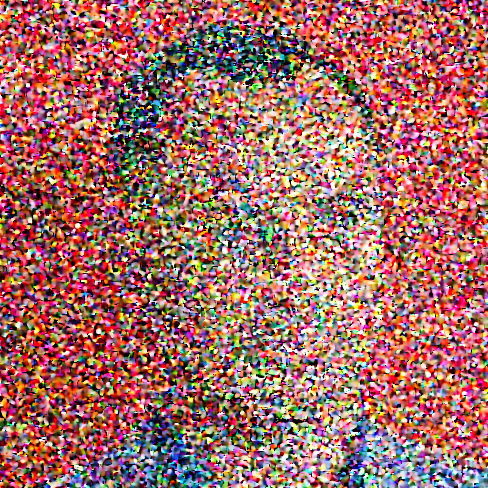 | **중간 생성**: 주요 특징들이 자리 잡음. (SONIC 영향력이 감소하는 지점) |
| **030** | 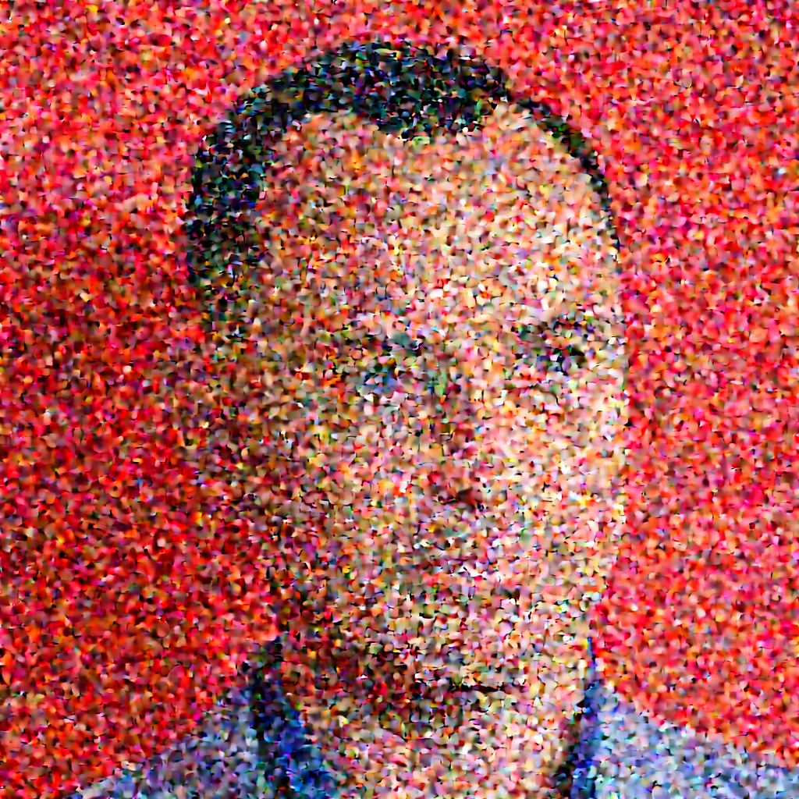 | 텍스처가 구체화 (이 지점부터 색감이 진해지는지 확인 필요) |
| **040** | 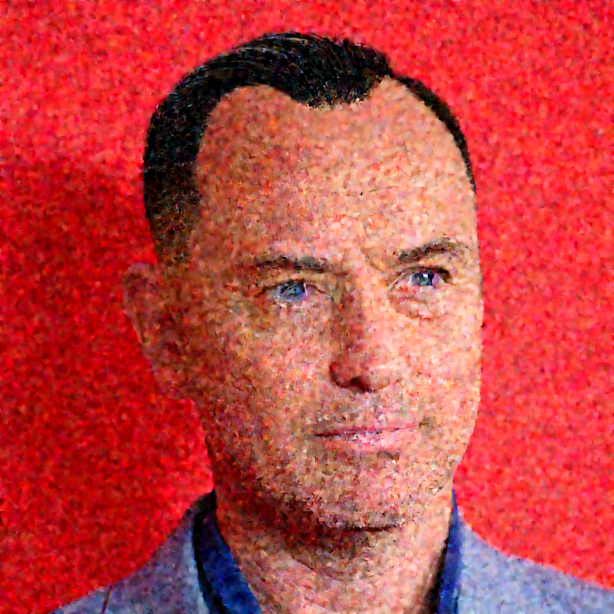 | **다듬기**: 미세한 디테일이 추가됨. |
| **049** | 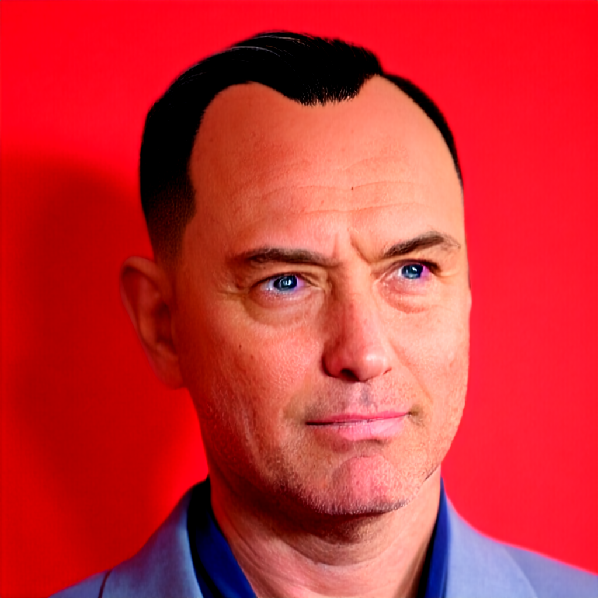 | **최종 결과**: 디노이징이 완료된 최종 출력물임. |

## 3. SONIC 영향력 분석
- **지속 구간**: SONIC의 영향력은 초기 단계(0~15)에서 가장 강력합니다.
- **전환**: Step 20 정도가 되면 모델의 고유한 생성 능력(Generative Priors)이 주도권을 잡고 사실적인 텍스처를 채워 넣습니다. 만약 후반부(40+)에서 이미지가 "탄 것처럼(burnt)" 보이거나 너무 어둡다면, `guidance_scale`(프롬프트 강도)이 너무 높거나 VAE의 색상 이동(Color Shift) 문제일 수 있습니다.

# Color Preservation을 위한 노력

원본 이미지의 색상과 품질을 유지하면서 자연스러운 헤어를 생성하기 위해 적용된 핵심 기술들을 정리하고, 최근 결과물을 비교했습니다.

## 1. Soft-Blending (배경 보존)
"Soft-Blending" 기법을 통해 원본 배경이 변질되지 않고 온전히 유지되었습니다.

### Soft-Blending

Soft-Blending은 생성된 이미지를 단순히 흐리게 섞는 방식이 아니라, 확산 기반 생성 모델의 생성 과정 자체를 제어하여 경계 영역을 자연스럽게 융합하는 기법이다.

기존의 이진 마스크 대신, 경계 영역에 연속적인 값(0~1)을 갖는 soft mask를 적용하거나 latent space에서 경계 부근의 노이즈를 점진적으로 조절한다.
이를 통해 모델은 해당 영역을 원본과 생성 결과가 함께 고려되어야 하는 영역으로 인식한다.

Diffusion 과정에서 마스크 내부는 높은 노이즈로 새롭게 생성하고,
경계 영역은 원본 latent에 낮은 노이즈를 추가하여 시작함으로써
피부와 머리카락이 구조적·조명적으로 자연스럽게 연결되도록 유도한다.

이 방식은 생성 이후 경계를 흐리는 기존 Blur 기반 기법과 달리,
생성 단계에서 경계를 함께 만들어내기 때문에 디테일 손실이 적고 경계가 자연스럽다.

- **적용 결과**: 생성된 헤어와 배경 사이의 합성이 부드럽게 이루어지면서도, 배경 영역의 픽셀 데이터는 변경 없이 **완벽하게 보존(Preserved)**되었습니다.

## 2. 정밀한 마스킹 (SegFace)
자연스러운 합성을 위해서는 마스크가 칼같이 정확해야 합니다.
- **SegFace 도입**: 기존 모델보다 월등히 정밀한 SegFace를 도입하여 마스크 품질을 높였습니다.
- **역할**: 머리카락이 심어질 위치를 픽셀 단위로 정확히 특정해줌으로써, 모델이 "어디까지가 원본이고 어디부터가 생성인지"를 명확히 구분하게 돕습니다. 이를 통해 원본 얼굴 영역을 침범하지 않고 필요한 부분에만 헤어를 생성합니다.

## 3. 모델 본연의 Blending 능력 활용 (TinyAdapterNative)
인위적인 후처리 대신, 모델 학습 단계에서 해결책을 찾았습니다.
- **Native Adapter**: 학습 시 1024px 고해상도에서 마스크 정보를 주입받아, 모델 스스로가 "경계면을 자연스럽게 잇는 법"을 학습했습니다.
- **결과**: 별도의 후처리 블러 없이도, 모델 생성 결과물 자체가 원본 톤과 자연스럽게 어우러지도록 유도됩니다.

## 4. Result Comparison (0125 vs 0128)
초기 결과(0125)와 개선된 Soft-Blending 전략이 적용된 최근 결과(0128)를 원본과 비교한 표입니다.

| ID | Original | Result (01/25) | Result (01/28) |
| :---: | :---: | :---: | :---: |
| **test1** | 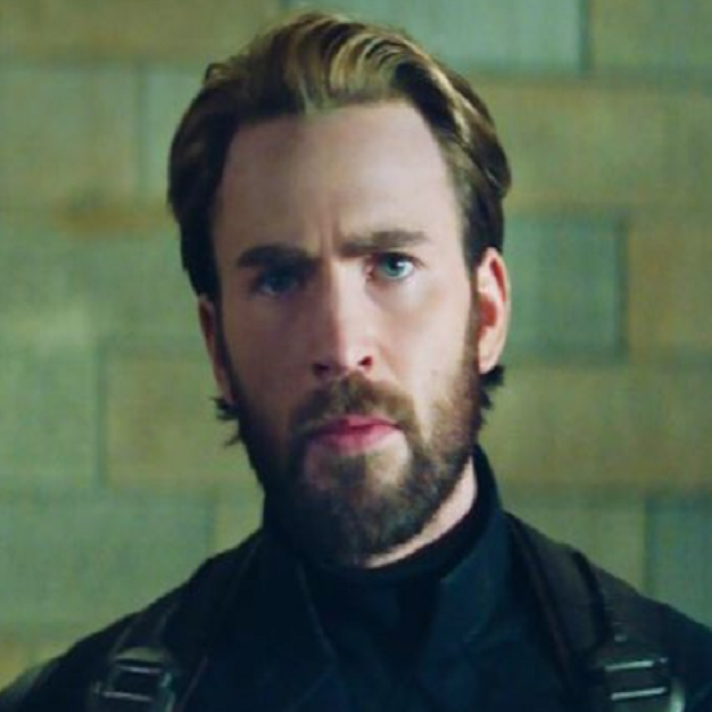 |  | 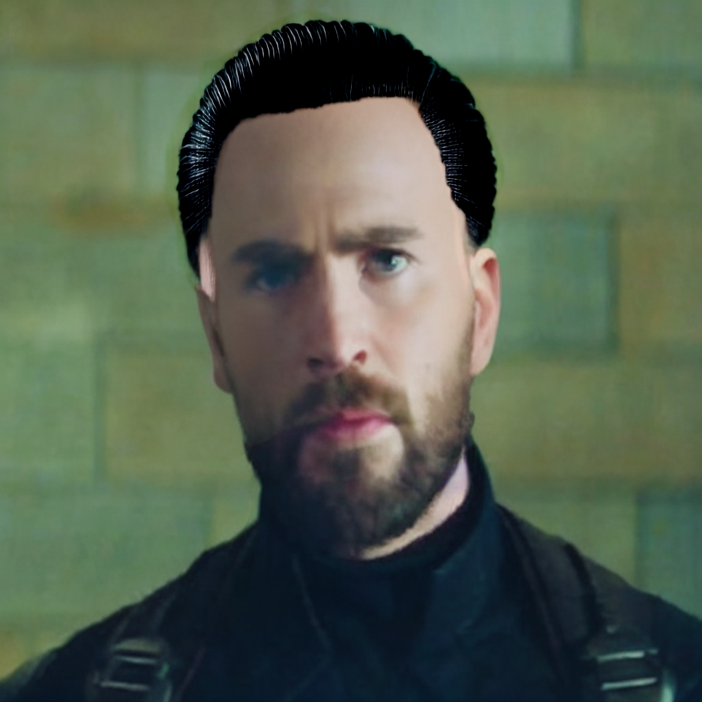 |
| **test2** | 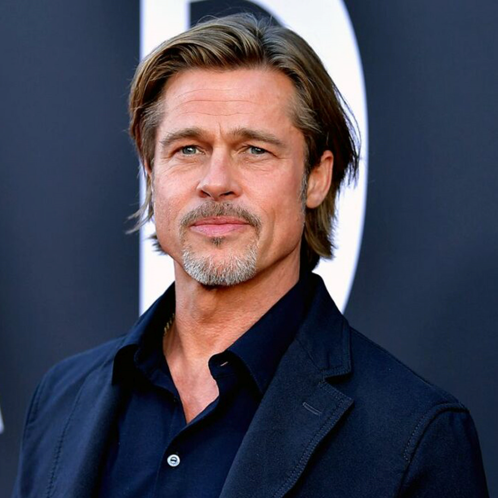 |  | 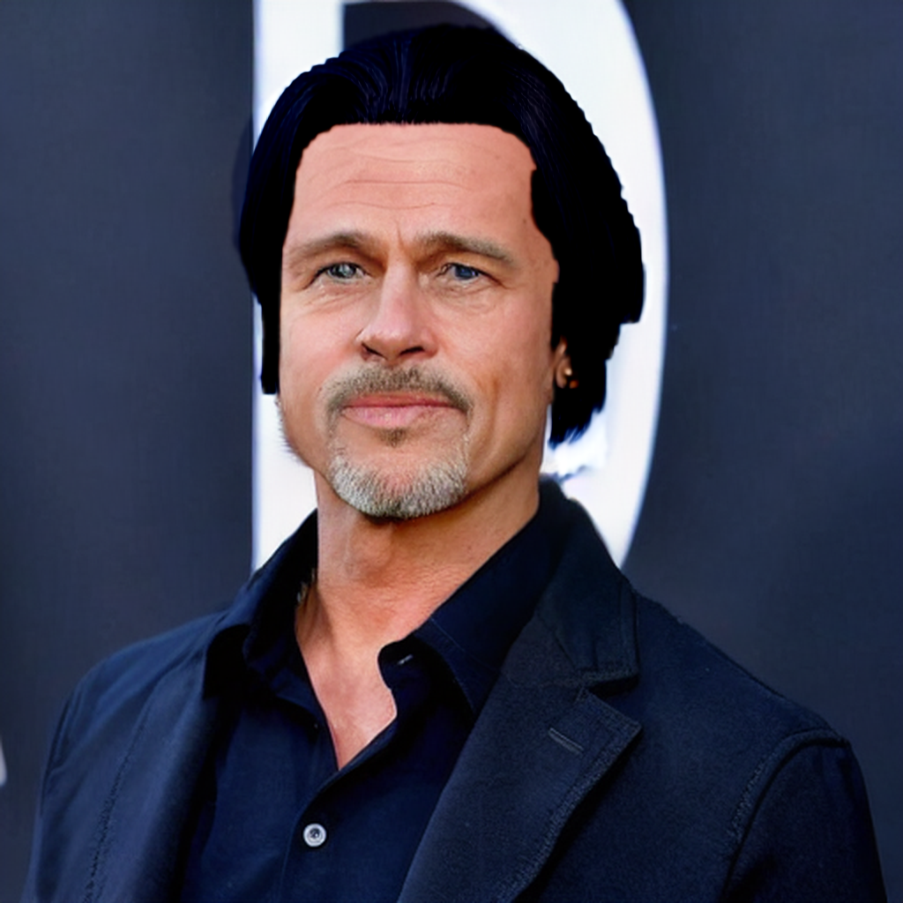 |
| **test3** | 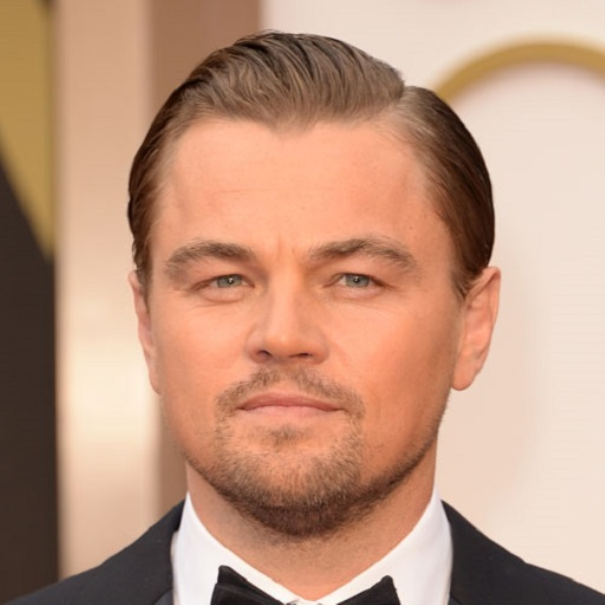 |  | 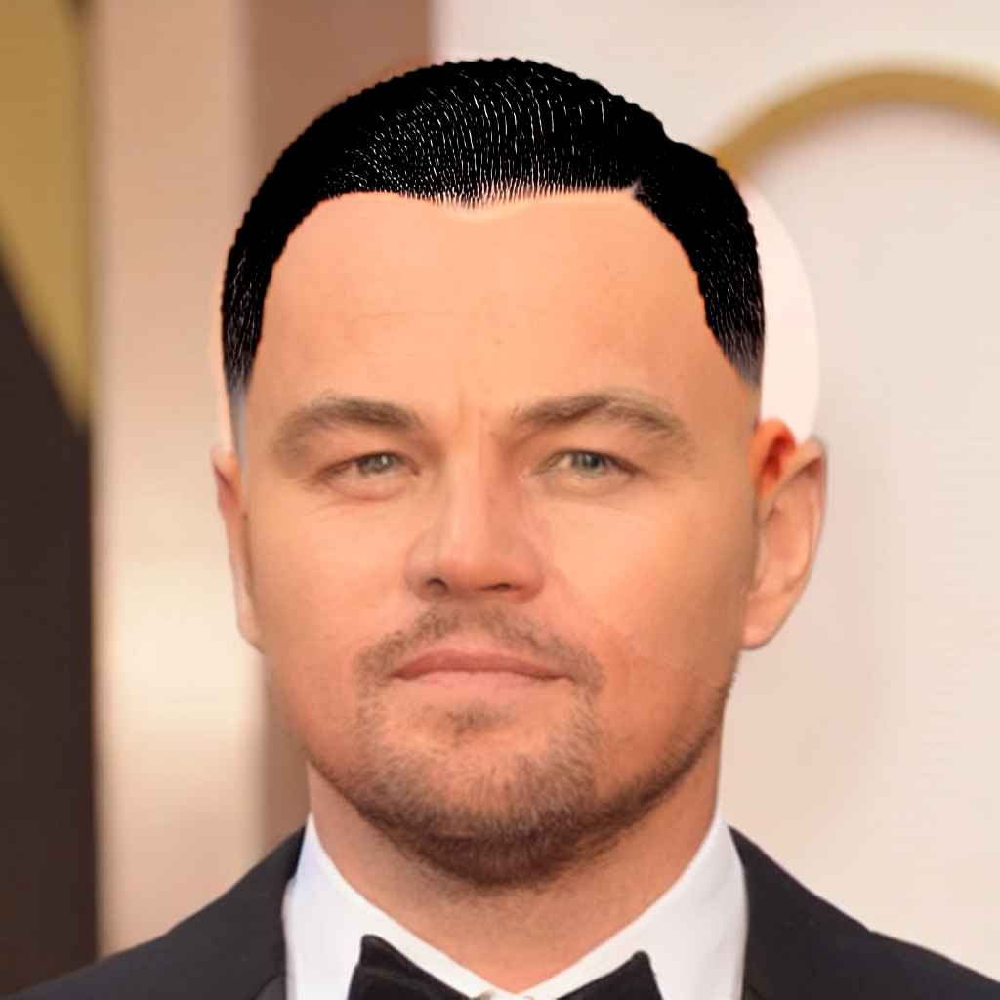 |
| **test6** | 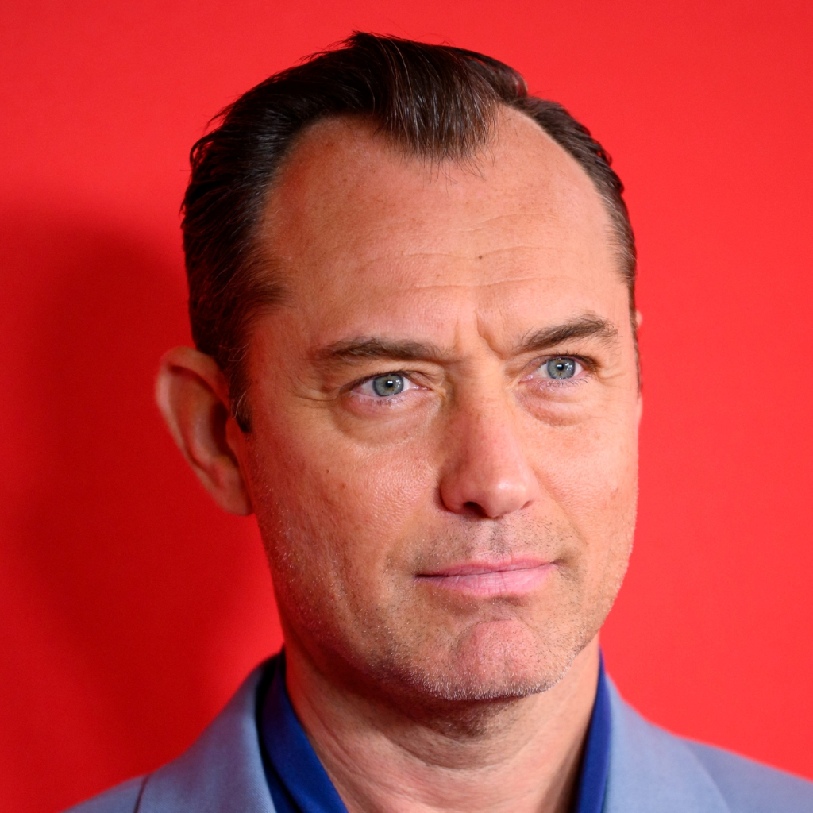 |  | 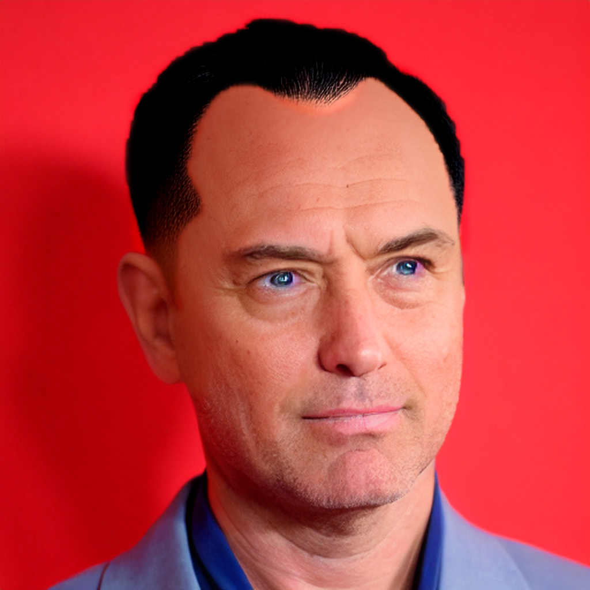 |

얼굴 색 진해지는 부분은 해결함. 헤어 부자연스러움은 여전히 남아있음. 자연스러움은 soft-blending 적용 전이 더 좋은 듯
이 둘 사이의 trade-off를 해결할 수 있는 방안을 고안해보아야 함.

