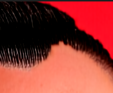
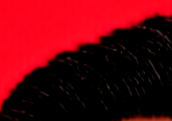

# Seamless Hair Generation: 기술적 분석 및 방법론 

## 1. 서론: 경계 연속성의 도전 과제 

확산 모델(Diffusion Model) 기반의 헤어 생성, 특히 마스크 기반 조건부 생성환경에서 가장 치명적인 문제는 생성된 헤어와 보존된 얼굴 영역 사이의 Seamlessness을 확보하는 것입니다. 일반적인 인페인팅 파이프라인에서는 주로 두 가지 아티팩트가 발생합니다.

1.  **Hard Seams (Aliasing)**: Latent 리사이징 과정에서 저차원 보간법 사용으로 인해 발생하는 계단 현상 및 거친 경계.
2.  **Halo/Bleed Effects**: 이진 마스킹(Binary Masking)으로 인해 생성된 텍스처가 피부톤과 자연스럽게 섞이지 못하고 색상이 번지거나 부자연스러운 경계가 형성되는 현상.

본 문서는 이러한 문제를 해결하고 고해상도의 자연스러운 헤어 통합을 달성하기 위해 적용된 기술적 방법론을 기술합니다.

## 2. 공간 재샘플링 전략: Bilinear에서 Lanczos로의 전환

### 2.1. Bilinear 보간법의 한계
기존 **Native Adapter의 학습(Training) 데이터 전처리 과정**에서 입력 이미지와 마스크를 리사이징할 때 **Bilinear Interpolation**이 사용되었습니다. ($1024 \times 1024$ 변환)

Bilinear 보간법은 계산 효율성은 좋으나, 고주파수(High-frequency) 공간 정보를 평활화시키는 Low-pass filter 역할을 합니다. 피부와 머리카락이 만나는 헤어라인과 같이 급격한 변화가 일어나는 경계 영역에서 이는 다음과 같은 문제를 야기합니다.
*   **Edge Definition 손실**: 마스크의 경계가 모호해짐.
*   **Staircase Artifacts**: 대각선 경계에서 선명한 라인을 복원하지 못하고 "픽셀화"된 형태가 나타남.

#### 시각적 증거 (Visual Evidence: Bilinear Artifacts)
실제 학습된 모델이 생성한 결과에서 발견되는 Bilinear Aliasing 아티팩트입니다. (Source: `test6_1.png`)

| Artifact Crop 1 | Artifact Crop 2 | Full Source (Native2) |
| :---: | :---: | :---: |
|  |  |  |
| **계단 현상 확대 1** | **계단 현상 확대 2** | **전체 이미지 (Aliasing 발생)** |

### 2.2. Lanczos Resampling 도입
이를 완화하기 위해 우리는 **Lanczos Resampling** (Spatially-windowed Sinc interpolation)을 제안 및 구현하고 있습니다.
$$ L(x) = \begin{cases} \text{sinc}(x)\text{sinc}(x/a) & \text{if } -a < x < a \\ 0 & \text{otherwise} \end{cases} $$
Sinc 함수의 lobe를 활용하는 Lanczos 리샘플링은 Bilinear 방식보다 공간적 선명도(Spatial Sharpness)를 훨씬 더 잘 보존합니다.

*   **추론(Inference) 전략**: **Semantic Mask**와 **Bald Reference Image**의 전처리 단계에서 Lanczos 보간법을 적용합니다. 이는 Latent Mask $M_{latent}$가 흐릿하게 퍼지지 않고 날카롭고 정밀한 경계를 유지하게 하여, 확산 모델이 머리카락 끝부분을 뭉개지 않고 자연스럽게 마무리할 수 있도록 유도합니다.

## 3. 적응형 경계 처리: "Smart Blur" 알고리즘 (Adaptive Boundary Processing)

단순한 가우시안 블러(Gaussian Blur)는 헤어 영역 전체를 일률적으로 흐리게 만들기 때문에 부적절합니다. 우리는 **"Hair Core"**(확실한 마스킹 필요)와 **"Transition Zone"**(섬세한 블렌딩 필요, 헤어라인 등)을 구분하는 **적응형 "Smart Blur" 알고리즘**을 구현했습니다.

### 3.1. 의미론적 분할 및 보호 영역 (Semantic Segmentation & Protection Idea)
핵심 아이디어는 픽셀 수준의 의미론적 라벨(Pixel-level semantic labels)을 활용하여 동적인 **보호 구역(Protection Zone)**을 생성하는 것입니다. 이는 응집력이 필요한 부분은 과감하게 블러링하되, 중요한 특징(이마, 얼굴 등) 근처에서는 보수적으로 처리하도록 합니다.

**알고리즘 정의:**
$M_{raw}$를 원본 시맨틱 마스크라고 할 때:

1.  **영역 추출 (Region Extraction)**:
    *   **Hair Mask ($H$)**: $M_{raw} > \tau_{hair}$ (e.g., 200) 인 픽셀.
    *   **Face Mask ($F$)**: $\tau_{face\_min} < M_{raw} < \tau_{face\_max}$ (e.g., 50 < pixel < 200) 인 픽셀.

2.  **보호 구역 형성 ($Z_{protect}$ Formularization)**:
    얼굴 경계가 과도한 블러링으로 침범당하지 않도록 "보호"하는 구역을 정의합니다. 이는 Face Mask ($F$)를 형태학적 팽창(Morphological Dilation)시킨 후 가우시안 감쇠(Ease-out)를 적용하여 계산합니다.
    $$ Z_{protect} = G_{\sigma_{protect}}(\text{Dilate}(F, k)) $$
    *   *Dilate*: 보호 영역을 잠재적 헤어라인 영역 *안쪽으로* 확장시킵니다.
    *   *Gaussian*: 보호 가중치(Weight)가 부드럽게 줄어들도록 합니다.

3.  **이중 스케일 블러링 (Dual-Scale Blurring)**:
    Hair Mask ($H$)를 두 가지 다른 스케일로 처리합니다.
    *   **Heavy Blur ($H_{heavy}$)**: 커널 $4\sigma$로 생성. 헤어 볼륨 전체에 부드러운 그라디언트를 형성하여 전역적인 일관성을 보장합니다.
    *   **Light Blur ($H_{light}$)**: 커널 $\sigma$로 생성. 헤어 가닥이 시작되는 부분의 즉각적인 엣지 디테일을 보전합니다.

### 3.2. 그라디언트 기반 합성 (Gradient-based Compositing)
최종 마스크 $M_{final}$은 보호 구역(Protection Zone)에 의해 변조(Modulated)된 Light Blur와 Heavy Blur 맵 사이의 선형 보간으로 합성됩니다.
$$ M_{final} = Z_{protect} \odot H_{light} + (1 - Z_{protect}) \odot H_{heavy} $$

**기술적 효과**:
*   **얼굴 인근 ($Z_{protect} \approx 1$)**: 마스크가 $H_{light}$를 따르므로, 얼굴 기하학을 침범하지 않는 날카롭고 정밀한 헤어라인이 형성됩니다.
*   **헤어 볼륨 내부 ($Z_{protect} \approx 0$)**: 마스크가 $H_{heavy}$를 따르므로, 밀도가 높은 헤어 영역에서 노이즈 아티팩트를 방지하는 부드러운 가이드를 제공합니다.

### 3.3. 시각화 결과 (Visualization)
다음은 Smart Blur 및 Adaptive Boundary Processing이 적용된 마스크의 시각화 결과입니다.

| Before | Now |
| :---: | :---: |
|  |  |

왼쪽의 이미지는 왼쪽 옆머리 부분이 과하게 blur 처리가 되어 모델이 이 부분을 머리부분이라고 인식하지 못할 수도 있다.

#### 최종 생성 레퍼런스 비교 (Generation Results Reference)
이러한 마스킹 개선이 실제 생성 결과에 미치는 영향은 다음과 같습니다.

| Before | Now |
| :---: | :---: |
|  |  |
| **기존 결과** | **개선된 파이프라인 결과** |

#### 3.4. 최적 파라미터 구성 (Experimental Hyperparameters)
위의 개선된 결과(Now)는 다음 파라미터 조합에서 최적의 성능을 보였습니다.

*   **Blur**: 0.8
*   **Adapter Scale**: 3.0 (Geometry 유도 강도 강화)
*   **Blur Radius**: 5.0 (Smart Blur 기본 반경)

## 4. 잠재 공간 일관성 (Latent Space Consistency)

생성된 결과물이 단순한 "합성 붙여넣기"가 되지 않도록, 디노이징 과정에서 **Latent Blending** 기법을 활용합니다.
$$ z_{t-1} = M \cdot z_{pred} + (1-M) \cdot z_{bg} $$
매 타임스텝 $t$마다 배경 잠재 벡터($z_{bg}$)를 강제함(Enforce)으로써, 비-헤어 영역(얼굴, 배경)이 소스 이미지와 수학적으로 동일하게 유지되도록 보장합니다. 이는 VAE 재구성 과정에서 흔히 발생하는 "스펙트럼 이동(Spectral Shift)"이나 색상 변조(Color Drifting) 현상을 방지합니다.

---
**요약**: **Lanczos Resampling** (고주파 경계 보존)과 **Smart Blur Compositing** (공간 적응형 마스킹)의 결합은 "Seamless" 생성 문제를 해결하는 견고한 솔루션입니다. 이를 통해 확산 모델은 질감적으로 사실적일 뿐만 아니라 기하학적으로도 두상 형태와 완벽하게 일치하는 헤어를 생성할 수 있습니다.

### 5.1. 프롬프트 및 모델 성능 비교
**Test Prompt**: "natural realistic male hairstyle, black hair, subtle hair detail, soft natural texture, clean look, high detail, 8k"

| ID | Semantic Mask | Before | After | Nano Banana |
| :---: | :---: | :---: | :---: | :---: |
| **test1** |  |  |  | TBD |
| **test2** |  |  |  | TBD |
| **test3** |  |  |  | TBD |
| **test4** |  |  |  | TBD |
| **test5** |  |  |  | TBD |
| **test6** |  |  |  | TBD |

### 5.2. 다양한 프롬프트 실험
| Prompt | test1 (Clean) | test4 (M-shape) | test6 (Complex) |
| :--- | :---: | :---: | :---: |
| "high quality realistic male hairstyle, low skin fade haircut, black hair, clean sides, textured top, dry matte finish, sharp hairline, natural lighting, high detail, 8k" |  |  |  |
| "realistic korean male two block haircut, dark brown hair, soft volume, clean contour, slightly wavy textured fringe, natural shine, high detail, 8k" |  |  |  |
| "realistic male textured crop haircut, short fringe, ash gray highlights on dark base, rough texture, slightly tousled top, modern barbershop style, cinematic lighting, ultra-detailed, 8k" |  |  |  |
| "realistic male hairstyle, natural perm with soft waves, medium length fringe pushed slightly forward, subtle brown highlights, airy movement, fluffy texture, high detail, 8k" |  |  |  |
| "realistic male slicked back hairstyle, blonde hair color, wet glossy texture, strong hold finish, clean sides, sharp edges, modern gentleman style, high fidelity detail, 8k" |  |  |  |
