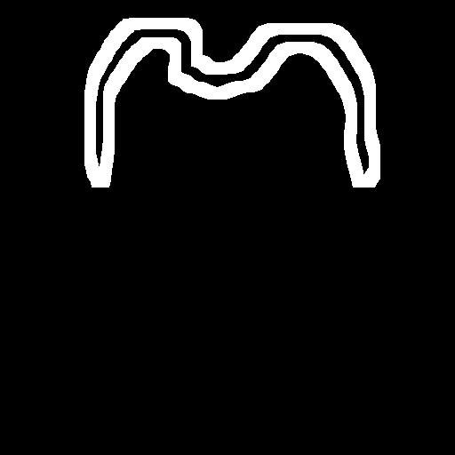
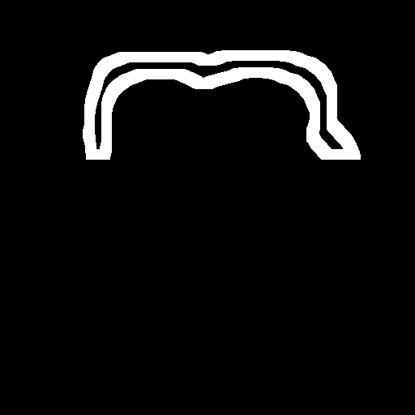
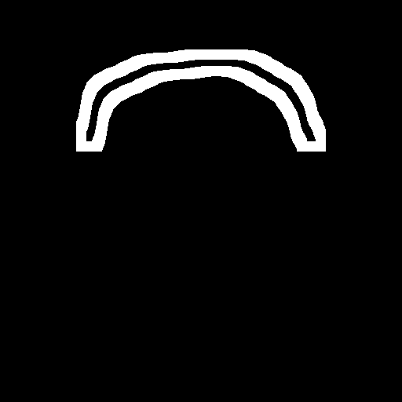
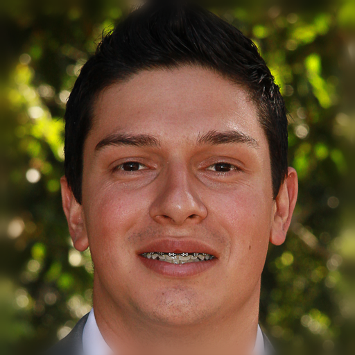

# Hairline V3_확장판

## 1. 핵심 전략

기존의 Latent IdentityNet은 4채널 입력(대머리 이미지)만 받을 수 있었습니다. 이를 **5채널 입력(대머리 + 마스크)**으로 확장하면서도, 기존의 학습된 능력을 100% 보존하는 전략을 사용했습니다.

| 순서 | 데이터 종류 | 채널 수 | 설명 |
| :--- | :--- | :--- | :--- |
| 기존 | Bald Proxy Latent | 4 | VAE가 압축한 대머리 정보 (얼굴, 배경 등 보존용) |
| 추가 | Hairline Mask | +1 | 어디까지 머리를 심을지 알려주는 흑백 가이드 |
| **합계** | **New Input** | **5** | **Latent IdentityNet이 받아야 할 총 입력** |

### 구현 원리
1.  **Main UNet 보존**: Main UNet은 **순정 4채널 입력**을 그대로 유지합니다. (기존 SD 1.5 호환성 유지)
2.  **IdentityNet 확장**: IdentityNet의 입력 레이어(`conv_in_2`)를 4채널에서 5채널로 확장합니다.
3.  **Zero Initialization**:
    *   **채널 0~3 (대머리)**: 기존 Pretrained 가중치를 그대로 복사합니다. (기존 지식 보존)
    *   **채널 4 (마스크)**: **0으로 초기화**합니다. (초기 충격 방지 및 점진적 학습 유도)

```python
# Weight Surgery Code Snippet
# 주의: ControlNetModel의 입력 레이어 이름은 'conv_in_2'입니다.
old_conv_weight = controlnet.conv_in_2.weight.data # Shape: [320, 4, 3, 3]
new_conv_weight = torch.zeros((320, 5, 3, 3), device=controlnet.device)

# 1. 기존 지식 복사 (Preservation)
new_conv_weight[:, :4, :, :] = old_conv_weight

# 2. 새 채널 0으로 초기화 (Gradual Learning)
new_conv_weight[:, 4:, :, :] = 0.0

# 3. 이식
controlnet.conv_in_2.weight.data = new_conv_weight
```

---

## 2. 학습 (Training)

학습 시 모델은 다음과 같은 입력을 받습니다:
*   **Main UNet**: `Noisy Latent` (4채널)
*   **IdentityNet**: `Bald Proxy` (4채널) + `Hairline Mask` (1채널) = **5채널 Condition**

#### 코드 구현: 입력 데이터 준비 (Training)
`train_hairline_cond_v3.py`에서 마스크를 Latent 크기로 리사이징하고, 대머리 Latent와 결합(Concatenation)하는 과정입니다.

```python
# Prepare ControlNet Input: Concat [Bald Proxy, Mask] (5 channels)
# Resize mask to latent size (64x64) - Nearest Neighbor to preserve edges
mask_latents = F.interpolate(
    hair_masks, size=noisy_latents.shape[-2:], mode="nearest" 
)
controlnet_cond = torch.cat([z_bald, mask_latents], dim=1)
```

### 학습 명령어 (Lambda AI)
```bash
python3 train_hairline_cond_v3.py \
  --orig_dir="data/original_images" \
  --bald_dir="data/bald_images" \
  --mask_dir="data/only_forehead_line" \
  --controlnet_model_name_or_path="stage2/pytorch_model_2.bin" \
  --output_dir="hairline_cond_v3_innovation" \
  --train_batch_size=2 \
  --num_train_epochs=50 \
  --learning_rate=1e-5 \
  --checkpoints_total_limit=2 \
  --report_to="none" \
  --dataloader_num_workers=0
```

### 트러블슈팅 (Troubleshooting)
*   **AttributeError: 'ControlNetModel' object has no attribute 'controlnet_cond_embedding'**:
    *   **원인**: 커스텀 `ControlNetModel` 클래스는 일반적인 Diffusers 구조와 달리 `controlnet_cond_embedding`이 없고, 직접 `conv_in_2` 레이어를 사용합니다.
    *   **해결**: Weight Surgery 대상을 `controlnet.conv_in_2.weight`로 수정했습니다.
*   **SyntaxError: keyword argument repeated**:
    *   **원인**: `controlnet` 호출 시 `encoder_hidden_states` 인자가 중복되었습니다.
    *   **해결**: 중복된 인자를 제거했습니다.

---

## 3. 추론 (Inference)

추론 시에도 학습과 동일하게 IdentityNet에 5채널 입력을 제공해야 합니다.

### 추론 스크립트 (`infer_hairline_cond_v3.py`) 핵심 로직
Innovation 전략에 맞춰, 추론 시에도 5채널 입력을 구성합니다.

#### 코드 구현: 입력 데이터 준비 (Inference)
`infer_hairline_cond_v3.py`에서 `z_bald`와 `mask_latent`를 결합하여 ControlNet에 전달합니다.

```python
# z_bald: VAE로 인코딩된 대머리 이미지 Latent
# mask_latent: 64x64로 리사이징된 헤어라인 마스크

# Prepare ControlNet Condition: Concat [Bald Proxy, Mask] (5 channels)
controlnet_cond = torch.cat([z_bald, mask_latent], dim=1)

# ...

# Latent IdentityNet Forward
down_block_res_samples, mid_block_res_sample = controlnet(
    sample=latents,
    timestep=t,
    encoder_hidden_states=text_embeddings,
    controlnet_cond=controlnet_cond, # 5-channel Input
    return_dict=False,
)
```

### 추론 명령어 예시
```bash
python3 infer_hairline_cond_v3.py \
  --bald_path "data/bald_images/01047.png" \
  --mask_path "data/only_forehead_line/01047.png" \
  --controlnet_path "hairline_cond_v3_innovation/controlnet" \
  --unet_path "hairline_cond_v3_innovation/unet" \
  --out_dir "result/v3_innov_test" \
  --init_latent noise \
  --noise_strength 1.0

```

<div align="center">
  
  
  
  
</div>

<div align="center">
  
  
  
  
</div>

<div align="center">
  
  
  
  
</div>

<div align="center">
  
  
  
  
</div>

<div align="center">
  
  
  
  
</div>


<div align="center">
  
  
  
  
</div>

<div align="center">
  
  
  
  
</div>

<div align="center">
  
  
  
  
</div>

<div align="center">
  
  
  
  
</div>


