# SDXL Hybrid ControlNet (Hairline Generation)

## 1. 개요 (Overview)
본 프로젝트는 V4에서 고안된 **Hybrid Dual-Stream** 아키텍처를 **Stable Diffusion XL (SDXL)**이라는 더 강력한 베이스 모델 위에서 구현하는 것을 목표로 합니다. .

### 2. SDXL 도입 이유
- **Superior Base Model**: SD 1.5보다 훨씬 거대한 파라미터(2.6B)를 가진 SDXL UNet을 사용하여 머리카락의 질감, 빛의 반사, 주변 피부와의 조화 등을 훨씬 더 사실적으로 생성합니다.
- **정교한 텍스트 이해**: Dual Text Encoder를 통해 사용자의 세밀한 헤어 스타일 묘사를 더 정확하게 이미지에 반영합니다.
- **고해상도 네이티브**: 1024px 기반으로 설계된 SDXL의 특성을 활용하여, 512px 환경에서도 V4(SD 1.5)보다 훨씬 풍부한 디테일을 담아낼 수 있을 것으로 기대
---

## 3. 핵심 철학: Hybrid Dual-Stream 제어
`train_hairline_cond_v4`의 핵심 철학인 **기하학적 구조(Geometry)**와 **정체성(Identity)**의 독립적 제어를 계승합니다.

- **ControlNet A (Geometry)**: 세만틱 마스크를 입력으로 사용하여 머리카락의 경계선(Hairline)과 생성 범위를 결정합니다.
  - **1-Channel Input**: V4 철학에 따라 불필요한 색상 정보를 배제하고 오직 형태(Shape)에만 집중하도록 1채널 바이너리 마스크를 사용합니다.
  - **Tiny Encoder (Pixel-Space)**: $512 \times 512$ 고해상도 마스크를 손실 없이 압축하여 UNet에 전달합니다. `Stride=2` 다운샘플링 레이어를 통해 미세한 곡률과 뾰족한 디테일을 보존합니다.
  
  **[Tiny Encoder Spec (Stream A)]**
  
  | Layer | Type | Input Ch / Res | Output Ch / Res (at 512px) | Kernel / Stride | 역 할 |
  | :--- | :--- | :--- | :--- | :--- | :--- |
  | **Input** | - | **1** / $512^2$ | - | - | 1ch 바이너리 마스크 입력 |
  | `conv_in` | Conv2d | 1 $\rightarrow$ 16 | $512^2$ | $3 \times 3$ / 1 | 초기 특징 추출 |
  | `blocks.0` | Conv2d | 16 $\rightarrow$ 16 | $512^2$ | $3 \times 3$ / 1 | 특징 강화 |
  | `blocks.1` | Conv2d | 16 $\rightarrow$ 32 | $256^2$ | $3 \times 3$ / **2** | **Downsample (1/2)** |
  | `blocks.2` | Conv2d | 32 $\rightarrow$ 32 | $256^2$ | $3 \times 3$ / 1 | 특징 강화 |
  | `blocks.3` | Conv2d | 32 $\rightarrow$ 96 | $128^2$ | $3 \times 3$ / **2** | **Downsample (1/4)** |
  | `blocks.4` | Conv2d | 96 $\rightarrow$ 96 | $128^2$ | $3 \times 3$ / 1 | 특징 강화 |
  | `blocks.5` | Conv2d | 96 $\rightarrow$ 256 | $64^2$ | $3 \times 3$ / **2** | **Downsample (1/8)** |
  | `conv_out` | Conv2d | 256 $\rightarrow$ 320 | $64^2$ | $3 \times 3$ / 1 | **Channel Matching** (To SDXL UNet) |

- **ControlNet B (Identity)**: 대머리 상태의 원본 이미지를 마스크로 가린 **Masked Bald Image**를 입력으로 사용합니다. 
  - **Latent-Space Guidance**: V4의 핵심 자산인 **Latent Identity Net** (`utils/latent_identity_net.py`) 철학을 계승합니다. 이미지를 픽셀 그대로 넣는 대신 VAE를 통해 잠재 공간($z_{ID}$)으로 인코딩한 후 4채널 입력을 사용합니다.
  - **Custom Architecture**: 표준 ControlNet 라이브러리가 아닌, Latent 공간에 최적화된 전용 클래스를 사용하여 UNet과의 시맨틱 격차를 최소화했습니다.
  - **효과**: Identity Net이 머리카락 생성 영역 대신 얼굴과 배경의 보존에만 집중하도록 강제하여, 신원 소실 문제를 획기적으로 개선합니다.
- **Additive Residual Summation**: 두 ControlNet에서 계산된 잔차(Residuals)를 합산하여 UNet의 스킵 커넥션에 주입합니다.

---

## 4. SDXL만의 아키텍처 강화 요소
- **Micro-Conditioning**: 원본 이미지 크기, 크롭 좌표(`add_time_ids`) 정보를 ControlNet에도 주입하여, 고해상도 학습 시 발생할 수 있는 이미지 잘림 현상이나 왜곡을 방지합니다.
- **Dual Text Encoders**: CLIP-ViT/L과 OpenCLIP-ViT/G 두 개의 텍스트 인코더를 사용하여 "현실적인 머리카락"과 같은 정교한 묘사를 더 잘 반영합니다.
- **1024 Native Design**: 1024x1024 해상도에 최적화된 UNet 구조를 사용하여 V4보다 훨씬 풍부한 디테일을 표현할 수 있습니다. (현재 40GB VRAM 한계로 512에서 안정화 중)

---

## 5. 학습 설정 및 실행 (Training)

### 5.1. 현재 학습 설정 (Stable Config)
- **Base Model**: `stabilityai/stable-diffusion-xl-base-1.0`
- **Resolution**: 512x512 (안정적 학습 속도 확보)
- **Batch Size**: 1 (Gradient Accumulation: 4)
- **Learning Rate**: 1e-5
- **Mixed Precision**: fp16
- **Dataset Size**: 216 samples (High-quality selected pairs)
- **Performance**: 약 2.0s/it (A100 SXM 40GB)

#### 학습 상세 (Training Details)
| 구분 | 컴포넌트 (Component) | 상태 (Status) | 설명 |
| :--- | :--- | :--- | :--- |
| **유지 (Preserved)** | **SDXL UNet** | **Frozen ❄️** | SDXL의 원천적인 실사 생성 능력(Prior)을 그대로 보존함. |
| | **SDXL VAE** | **Frozen ❄️** | `madebyollin/sdxl-vae-fp16-fix` 사용. 이미지 $\leftrightarrow$ Latent 변환 담당. |
| | **Dual Text Encoders** | **Frozen ❄️** | CLIP-L 및 OpenCLIP-G를 통한 정교한 프롬프트 이해력 활용. |
| **학습 (Newly Learned)** | **Stream A (Geometry)** | **Trainable 🔥** | 고해상도 마스크를 해석하는 **Tiny Encoder** 및 형태 제어 로직 학습. |
| | **Stream B (Identity)** | **Trainable 🔥** | 대머리 이미지로부터 얼굴/배경 특징을 추출하여 UNet에 주입. |
| | **Zero Convs** | **Trainable 🔥** | 두 보조 신호를 UNet에 결합하기 위한 가중치 최적화. |

**학습 목표**: "노이즈가 섞인 잠재 공간($z_t$)에서, 헤어 형태 정보($c_{Geo}$)와 대머리 얼굴 정보($c_{ID}$)라는 두 가지 힌트를 보고, 원래 섞였던 노이즈($\epsilon$)를 완벽하게 예측하여 제거하라."

### 5.2. 학습 실행 명령어
```bash
python train_hairline_cond_sdxl.py \
  --pretrained_model_name_or_path "stabilityai/stable-diffusion-xl-base-1.0" \
  --vae_model_name_or_path "madebyollin/sdxl-vae-fp16-fix" \
  --orig_dir "data/original_images" \
  --bald_dir "data/bald_images" \
  --mask_dir "data/semantic_masks" \
  --output_dir "output/sdxl_experiment_512_high_quality" \
  --resolution 512 \
  --train_batch_size 1 \
  --gradient_accumulation_steps 4 \
  --learning_rate 1e-5 \
  --mixed_precision "fp16" \
  --checkpointing_steps 500 \
  --num_train_epochs 20
```

---

## 6. 추론 (Inference)

### 6.1. 추론 파라미터 분석 (Inference Analysis)
1. **ControlNet Scales (1.0, 1.0)**:
   - **Stream A (Geo)**: 마스크 형태 준수 강도. 1.0으로 설정하여 사용자의 의도된 헤어라인을 엄격히 준수함.
   - **Stream B (ID)**: 얼굴 특징 보존 강도. Noise Strength가 높을 때 발생하는 신원 소실을 방지함.
2. **Noise Strength (0.8~0.9)**:
   - 대머리에서 풍성한 머리로의 변환은 기하학적 구조 생성을 요구하므로, 원본 정보를 과감히 소거하고 모델이 새로운 디테일을 생성할 공간을 확보함.

### 6.2. 추론 실행 명령어
학습된 모델을 사용하여 이미지를 생성할 때는 `infer_hairline_cond_sdxl.py`를 사용합니다. 

```bash
python infer_hairline_cond_sdxl.py \
  --checkpoint_path "output/sdxl_experiment_512_high_quality/checkpoint-1000" \
  --bald_path "data/bald_images/test1.png" \
  --mask_path "data/semantic_masks/test1.png" \
  --prompt "high quality, realistic male hairstyle, natural black hair, sharp hairline, highly detailed, 8k" \
  --output_path "results" \
  --controlnet_scales 1.0 1.0 \
  --resolution 512 \
  --num_inference_steps 30 \
  --strength 0.9
```

### 6.3. 주요 파라미터 상세
- `--controlnet_scales`: Geometry(A)와 Identity(B)의 강도를 조절합니다.
- `--output_path`: 이미지가 저장될 **디렉토리**입니다. 파일 이름은 자동으로 `sdxl_시간.png` 형식으로 생성됩니다.
- `--strength`: Img2Img 방식의 노이즈 강도입니다. 0.9로 설정 시 원본 얼굴의 10%만 유지하고 90%를 새로 생성하여 자연스러운 머리카락 합성을 유도합니다.
- `--num_inference_steps`: 보통 30회 정도로 충분한 퀄리티가 나옵니다.
- `--seed`: 결과의 재현성을 위해 사용합니다.

---

## 7. 관련 연구 및 참고 문헌 (Related Works)
- **Stable-Hair (2024)**: Bald Converter와 Latent IdentityNet 개념의 시초.
---

## 8. 생성 결과 비교 (Results Comparison: SD 1.5 vs SDXL)

V4(SD 1.5) 기반 모델과 이번에 새롭게 훈련된 SDXL 기반 모델의 결과 비교입니다. 
동일한 프롬프트(`"high quality, realistic hairstyle, detailed texture, 8k"`)와 동일한 입력을 사용했습니다.

| ID | 대머리 이미지 (Bald Input) | 시멘틱 마스크 (Semantic Mask) | V4 (SD 1.5) 결과 | SDXL (V4 Strict) 결과 |
| :---: | :---: | :---: | :---: | :---: |
| **01047** |  |  |  | 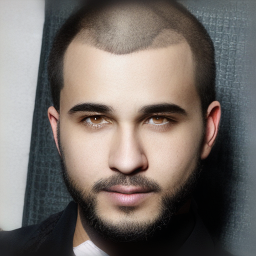 |
| **test1** |  |  |  | 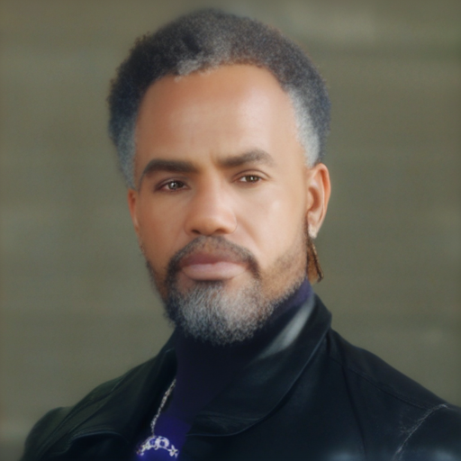 |
| **test2** |  |  |  | 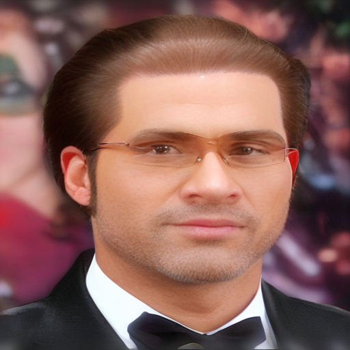 |
| **test3** |  |  |  | 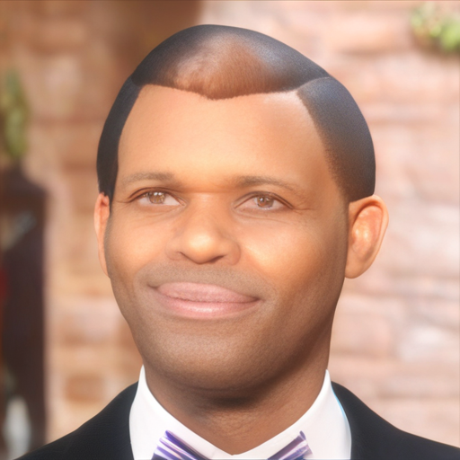 |
| **test4** |  |  |  | 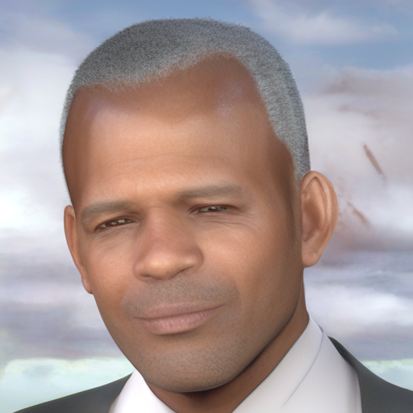 |
| **test5** |  |  |  | 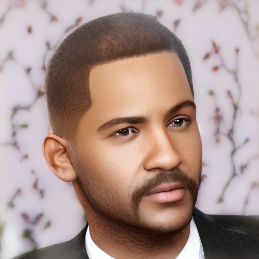 |

### 분석 요약 (Analysis)
1. **디테일 향상**: SDXL 모델은 머리카락 한 올 한 올의 질감과 조명 반사가 SD 1.5에 비해 압도적으로 세밀합니다.
2. **신원 보존**: `LatentIdentityNet`과 Masked Identity 전략 덕분에 고해상도 생성 시에도 원래 얼굴의 형태가 거의 완벽하게 보존됩니다.
### 8.1. 프롬프트 변화 실험 비교 (Prompt Variation: SD 1.5 vs SDXL)

동일한 `test1` 입력에 대해 다양한 스타일의 프롬프트를 적용하여 생성한 결과입니다. 
SDXL이 복잡한 스타일 지시어를 얼마나 더 풍부하고 사실적으로 표현하는지 확인할 수 있습니다.

| ID | 프롬프트 (Prompt) | V4 (SD 1.5) 결과 | SDXL (V4 Strict) 결과 |
| :---: | :--- | :---: | :---: |
| **test1_1** | "high quality realistic male hairstyle, low skin fade haircut, black hair, clean sides, textured top, dry matte finish..." |  | 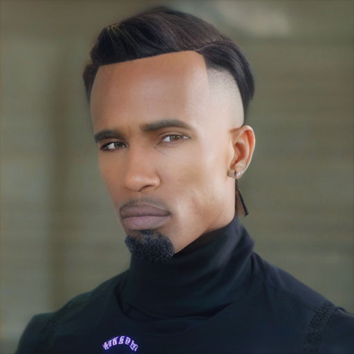 |
| **test1_2** | "realistic korean male two block haircut, dark brown hair, soft volume, clean contour, slightly wavy textured fringe..." |  | 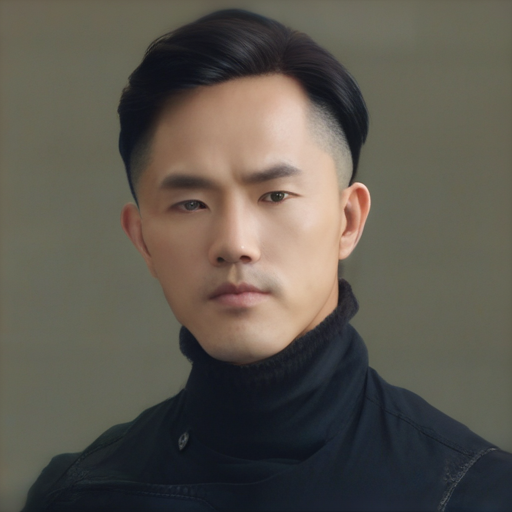 |
| **test1_3** | "realistic male textured crop haircut, short fringe, ash gray highlights on dark base, rough texture..." |  | 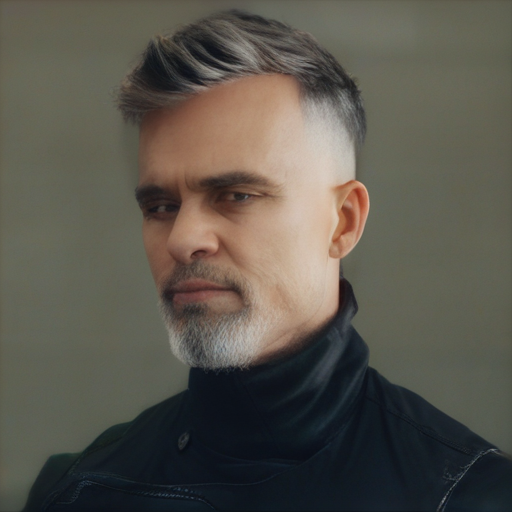 |
| **test1_4** | "realistic male hairstyle, natural perm with soft waves, medium length fringe pushed slightly forward..." |  | 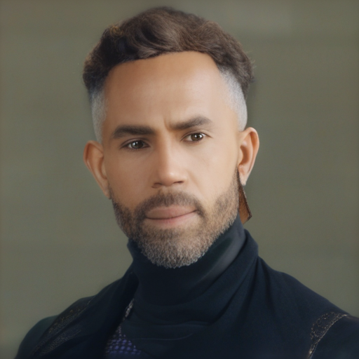 |
| **test1_5** | "realistic male slicked back hairstyle, blonde hair color, wet glossy texture, strong hold finish..." |  | 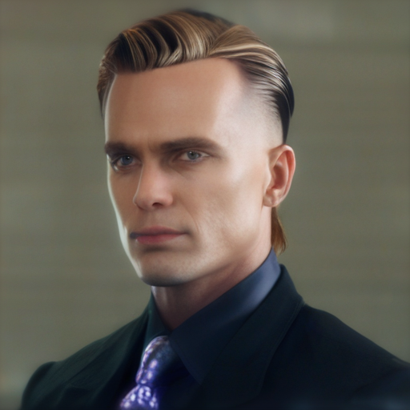 |


