# Project V4

## 1. 개요
기존 V3 모델의 한계점인 **'고주파 정보 소실(Information Collapse)'**과 **'허위 상관관계(Spurious Correlation) 학습'** 문제를 해결하기 위해 **V4**를 실험해보았다.

핵심 변경 사항은 단일 채널 마스크 입력을 **학습 가능한 'Tiny Encoder'**를 통해 다채널 특징(Multi-channel Feature)으로 변환하는 것과, 형태(Geometry)와 신원(Identity) 정보를 분리하여 주입하는 이원화된 구조의 도입이다.

---

## 2. 문제 정의
v3 모델에서 교수님의 피드백을 통해 식별된 핵심 문제는 다음과 같다

### 2.1. 불충분한 컨디셔닝
*   **현상**: $512 \times 512$ 해상도의 얇고 뾰족한 헤어라인(High-frequency details)을 $64 \times 64$로 단순 다운샘플링(Nearest/Bilinear)할 경우, 공간적 정보가 뭉개짐.
*   **결과**: UNet은 구체적인 형태 지시를 받지 못하고, 디테일은 살리지 못함.

#### 사례: 단일 채널 마스크로 인한 정보 붕괴
<div align="center">
  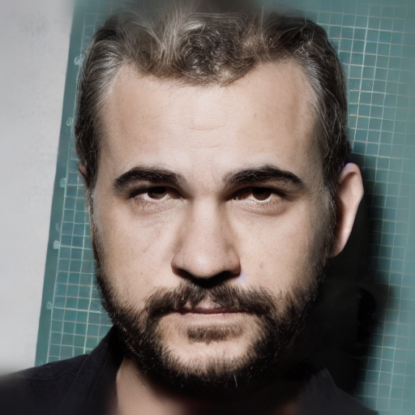
  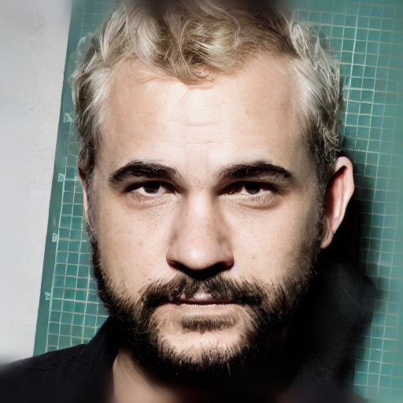
  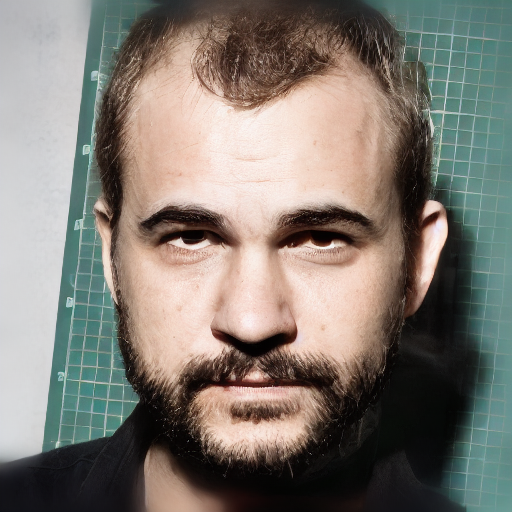
  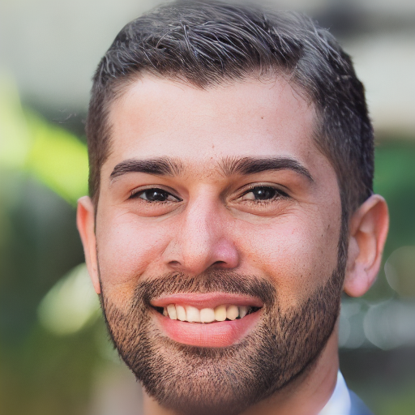
  
</div>

| 현상 | 설명 |
| :--- | :--- |
| **정보 붕괴 (Information Collapse)** | 단순 다운샘플링은 "어디에"는 전달하지만 "무엇을(예: 뾰족함)"은 전달하지 못함. |
| **의미적 간극 (Semantic Gap)** | UNet은 해당 영역을 *왜* 특정 방식(방향, 곡률)으로 복원해야 하는지 모름. |

### 2.2. 허위 상관관계 및 컨닝
*   **현상**: 대머리 이미지를 그대로 조건으로 사용할 경우, 모델이 헤어 마스크(형태)를 따르지 않고 허위 상관 관계를 단순 추론할 수 있음

    예) 대머리 이미지의 피부 경계(Texture Boundary)를 보고 헤어라인을 단순 추론함.
*   **결과**: 사용자가 원하는 새로운 헤어 스타일로의 제어가 불가능해짐.

---

## 3.V4: 이중 경로 제어 구조 (Dual-Path Control Structure)
Pixel-space의 고해상도 정보와 Latent-space의 효율적인 신원 정보를 결합하는 복합 구조를 실험해보았다.

### 3.1. 아키텍처 다이어그램 (Topology)

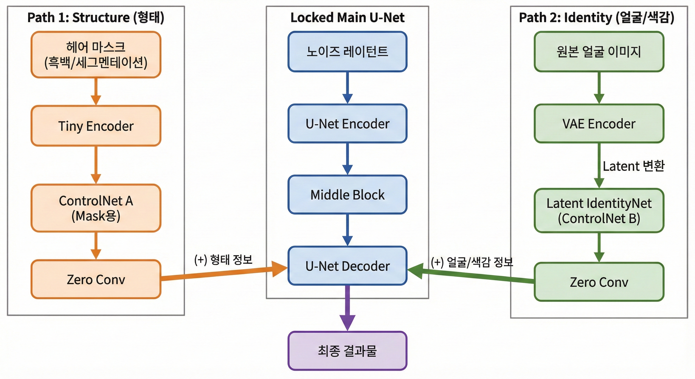

### 3.2. 핵심 모듈 상세 (Component Details)

#### A. Stream 1: Geometry Guide (Pixel-Space)
*   **입력**: $512 \times 512$ 고해상도 **바이너리 마스크**.
*   **모델**: Standard `ControlNetModel` (Tiny Encoder 포함).
*   **특징**: `Stride=2` 다운샘플링 레이어를 통해 고해상도 마스크의 미세한 곡률과 뾰족한 디테일(Geometry)을 손실 없이 압축하여 전달한다.
*   **Arch Ref**: 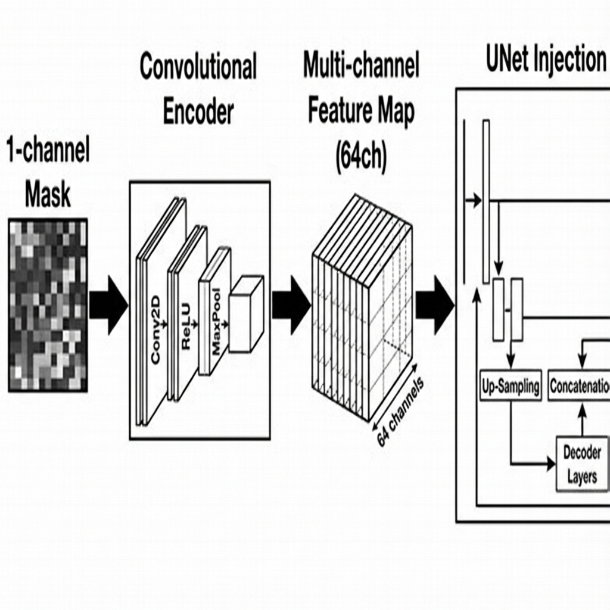
*   **목적**: "어떤 모양의 머리카락을 만들 것인가?" (Shape Control)
*   **Tiny Encoder Spec**:
    *   **입력**: $512 \times 512$ (1ch Binary Mask)
    *   **출력**: $64 \times 64$ (320ch Feature Map) $\rightarrow$ ControlNet Backbone의 첫 번째 Block 입력과 매칭됨.
    *   **계층 구조 (Layer Hierarchy)**:
    
    | Layer | Type | Input Ch / Res | Output Ch / Res | Kernel / Stride | 역 할 |
    | :--- | :--- | :--- | :--- | :--- | :--- |
    | **Input** | - | **1** / $512^2$ | - | - | 흑백 마스크 입력 |
    | `conv_in` | Conv2d | 1 $\rightarrow$ 16 | $512^2$ | $3 \times 3$ / 1 | 초기 특징 추출 |
    | `blocks.0` | Conv2d | 16 $\rightarrow$ 16 | $512^2$ | $3 \times 3$ / 1 | 특징 강화 |
    | `blocks.1` | Conv2d | 16 $\rightarrow$ 32 | $256^2$ | $3 \times 3$ / **2** | **Downsample (1/2)** |
    | `blocks.2` | Conv2d | 32 $\rightarrow$ 32 | $256^2$ | $3 \times 3$ / 1 | 특징 강화 |
    | `blocks.3` | Conv2d | 32 $\rightarrow$ 96 | $128^2$ | $3 \times 3$ / **2** | **Downsample (1/4)** |
    | `blocks.4` | Conv2d | 96 $\rightarrow$ 96 | $128^2$ | $3 \times 3$ / 1 | 특징 강화 |
    | `blocks.5` | Conv2d | 96 $\rightarrow$ 256 | $64^2$ | $3 \times 3$ / **2** | **Downsample (1/8)** |
    | `conv_out` | Conv2d | 256 $\rightarrow$ 320 | $64^2$ | $3 \times 3$ / 1 | **Channel Matching** (To Backbone) |

#### B. Stream 2: Identity Context (Latent-Space)
*   **입력**: $64 \times 64$ **Masked Bald Latent**
*   **모델**: latent_identity_net.py
*   **특징**: `Stride=1` 구조로, 이미 압축된 Latent 정보를 받아 추가적인 압축 없이 신원 정보(Identity)를 추출한다.
*   **목적**: 얼굴 보존

#### C. Hybrid Injection Mechanism
*   **방식**: 두 스트림의 출력을 **단순 덧셈(Add)**으로 결합한다.
*   **이점**: 
    1.  **형태 보존**: 512px 마스크에서 추출한 선명한 엣지 정보가 유지됨.
    2.  **신원 유지**: Latent Identity Net을 사용하여 얼굴 왜곡을 방지함.
*   **Ref**: 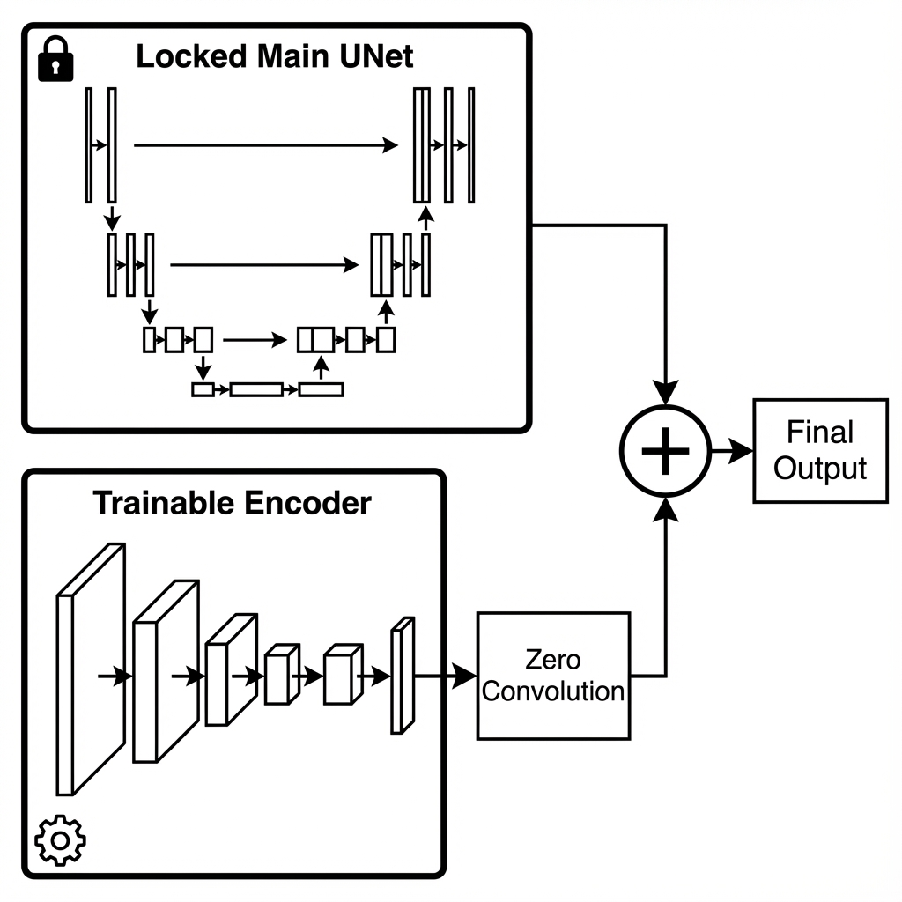

*   **train_hairline_cond_v4.py 내 코드**:
    ```python
    # 1. 두 ControlNet의 출력을 합쳐서 반환
    down_block_res_samples, mid_block_res_sample = controlnet(...) 

    # 2. Main UNet의 Decoder(Up-block)와 Middle-block에만 주입
    model_pred = unet(
        ...,
        down_block_additional_residuals=down_block_res_samples, # Skip Connection에 더해져 Decoder로 감
        mid_block_additional_residual=mid_block_res_sample,     # Middle Block에 더해짐
    )
    ```
    
#### D. 전략.
*   **반복 주입 (Layer-wise Injection)**:
    *   ControlNet과 UNet의 구조적 깊이(Depth)에 따라 총 **13번**에 걸쳐 정보가 주입된다.
    *   단순히 한 번 더해지는 것이 아니라, 해상도가 줄어드는 인코더의 각 단계마다 합쳐져서 Main UNet의 Decoder로 전달된다.
*   **구조**:
    *   **Down Blocks (12개)**: 다양한 해상도(Level)에서 디테일(Low-level)과 구조(High-level) 정보를 각각 주입.
    *   **Middle Block (1개)**: 가장 압축된 잠재 공간(Deepest Layer)에서 전체적인 맥락 정보를 주입.
*   **흐름 (Flow)**: Main UNet의 데이터 처리 순서(Forward Pass)를 따름
    1.  **Middle Block**: 가장 깊은 병목 구간에서 첫 번째 주입 $(A_{mid} + B_{mid})$.
    2.  **Decoder (Up-blocks)**: 해상도를 점차 키워가며 나머지 12번의 주입 수행.
        *   `Up-Block 1` (Low Res) $\leftarrow$ ControlNet `Down-Block 12` Output
        *   ...
        *   `Up-Block 12` (High Res) $\leftarrow$ ControlNet `Down-Block 1` Output


---

## 4. 데이터 파이프라인 및 학습 전략 (Training Strategy)

### 4.1. 데이터셋 구성 (Data Preparation)

| 입력 변수 | 데이터 소스 | 전처리 방식 (Preprocessing) |
| :--- | :--- | :--- |
| **Ground Truth** | 원본 이미지 | $512 \times 512$ Resize, Normalize |
| **Stream A (Geo)** | semantic 마스크 | Face Parsing Map에서 Hair 영역 추출 (Binary, 1ch) |
| **Stream B (ID)** | Bald Latent | 원본 $\times$ $(1 - \text{Mask})$ $\rightarrow$ **VAE Encode** ($64 \times 64$ Latent) |

### 4.2. 학습 로직 (Optimization)

#### 학습 (Training Details)
| 구분 | 컴포넌트 (Component) | 상태 (Status) | 설명 |
| :--- | :--- | :--- | :--- |
| **유지 (Preserved)** | **Stable Diffusion UNet** | **Frozen ❄️** | SD1.5의 사전 학습된 생성 능력(Prior)을 그대로 보존함. |
| | **VAE (Autoencoder)** | **Frozen ❄️** | 이미지 $\leftrightarrow$ Latent 변환 담당. 가중치 고정. |
| | **CLIP Text Encoder** | **Frozen ❄️** | 텍스트 프롬프트 이해 담당. 가중치 고정. |
| **학습 (Newly Learned)** | **Stream A (Tiny Encoder)** | **Trainable 🔥** | 512px 마스크를 해석하는 능력을 **처음부터(혹은 초기화 후) 학습**. |
| | **Stream B (Identity Net)** | **Trainable 🔥** | 얼굴 정보를 추출하여 UNet에 주입하는 방법을 학습. |
| | **Zero Convs** | **Trainable 🔥** | 두 스트림의 정보를 UNet에 얼마나/어떻게 더할지($\alpha$)를 학습. |

**학습 목표**: "노이즈가 섞인 이미지($z_t$)에서, 헤어 모양($c_A$)과 대머리 얼굴($c_B$) 힌트를 보고, 원래 섞였던 노이즈($\epsilon$)를 정확히 맞추시오."

---

## 5. 예상되는 개선 효과 

| 구분 | V3 (Previous) | V4 (Proposed) |
| :--- | :--- | :--- |
| **입력 해상도** | 64px (Latent All) | **512px (Geo) + 64px (ID)** |
| **형태 표현력** | 낮음 (Aliasing 발생) | **매우 높음 (Pixel-perfect Control)** |
| **신원 안정성** | 불안정 | **안정적 (Legacy Latent Net 활용)** |
| **구조적 유연성** | 단일 스트림 | **Dual-Stream (독립적 제어 가능)** |

---


## 6. 학습

```bash
accelerate launch --mixed_precision="fp16" --num_processes=1 train_hairline_cond_v4.py \
  --pretrained_model_name_or_path "runwayml/stable-diffusion-v1-5" \
  --output_dir "hairline_cond_v4_hybrid2" \
  --orig_dir "data/original_images" \
  --bald_dir "data/bald_images" \
  --mask_dir "data/semantic_masks" \
  --resolution 512 \
  --learning_rate 1e-5 \
  --train_batch_size 4 \
  --gradient_accumulation_steps 1 \
  --mixed_precision "fp16" \
  --num_train_epochs 200 \
  --checkpointing_steps 500 \
  --checkpoints_total_limit 3 \
  --report_to "tensorboard" \
  --logging_dir "logs"
```


## 7. 추론

### 7.1. Semantic Mask 기반 추론
학습 완료 후, 아래 명령어로 추론을 수행한다. `--controlnet_scales`를 조절하여 대머리 방지를 튜닝할 수 있다.

```bash
python3 infer_hairline_cond_v4.py --pretrained_model_name_or_path "runwayml/stable-diffusion-v1-5" --controlnet_path "hairline_cond_v4_hybrid2" --bald_path "data/bald_images/test1.png" --mask_path "data/semantic_masks/test1.png" --out_dir "hairline_cond_v4_test_semantic_check" --prompt "high quality, realistic hairstyle, detailed texture, 8k" --num_inference_steps 30 --controlnet_scales 1.0 1.0 --noise_strength 0.9
```

### 7.2. 주요 추론 파라미터 분석 (Inference Hyperparameters)
본 실험에서 사용된 핵심 파라미터의 선정 근거와 역할은 다음과 같다.

1.  `--controlnet_scales 1.0 1.0`
    *   Dual-Stream 구조에 맞춰 두 가지 ControlNet의 영향력을 개별적으로 제어한다.
    *   **Stream A (Geometry, 1.0)**: Pixel-space 마스크의 형태적 제약 강도. 값이 1.0 미만일 경우 마스크 경계를 벗어난 자연스러운 생성을 허용하나, 1.0으로 설정하여 사용자가 의도한 헤어라인을 준수하도록 하였다.
    *   **Stream B (Identity, 1.0)**: Latent-space에서 추출된 원본 얼굴 특징의 보존 강도. Noise Strength가 높을 때 발생할 수 있는 얼굴 변형을 방지하는 역할을 수행한다.

2.  `--noise_strength 0.9`
    *   Img2Img 파이프라인에서의 초기 노이즈 혼합 비율.
    *   **설정 근거**: 대머리에서 풍성한 머리로의 변환은 단순한 텍스처 변경이 아닌 기하학적 구조 생성을 요구한다. 따라서, 원본 이미지의 Pixel 정보를 90% 소거하여 모델이 새로운 고주파 디테일(High-frequency details)을 생성할 수 있는 Latent 공간을 확보하였다.
    *   **전략**: High Denoising(0.9)으로 인한 신원 소실 위험을 Identity ControlNet(Scale 1.0)으로 보정하는 실험을 진행하였다.

### 7.3. 실행 로그 예시 (Execution Log Example)
정상적으로 Hybrid Model이 로드되면 다음과 같은 로그가 출력됩니다:
```text
Loading Hybrid MultiControlNet components from hairline_cond_v4_hybrid2...
Loading Stream A (Geometry) from hairline_cond_v4_hybrid2/controlnet
Loading Stream B (Identity) from hairline_cond_v4_hybrid2/controlnet_1
Successfully combined separate ControlNets.
Starting inference from step 2 (Strength: 0.9, Running 28 steps)...
```

---


## 8. 결과


| 대머리 이미지 (Bald Input) | 시멘틱 마스크 (Semantic Mask) | 사용된 프롬프트 (Prompt) | 결과 이미지 (Output) |
| :---: | :---: | :--- | :---: |
|  |  | "high quality, realistic hairstyle, detailed texture, 8k" |  |
|  |  | "blonde hair, high quality, realistic hairstyle, detailed texture, 8k" | 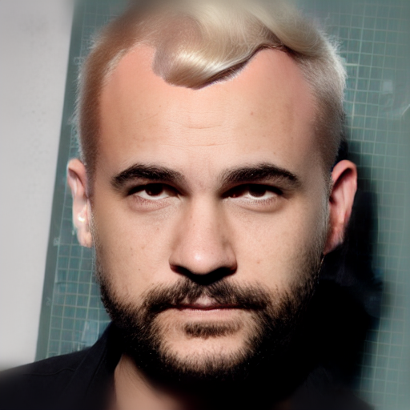 |
|  | 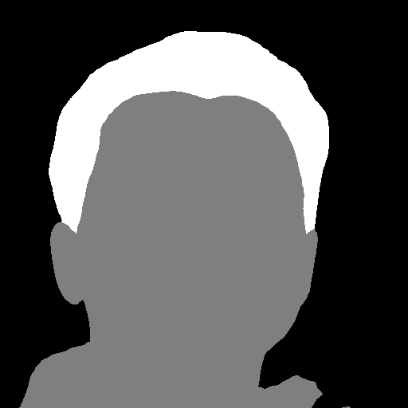 | "high quality, realistic hairstyle, detailed texture, 8k" | 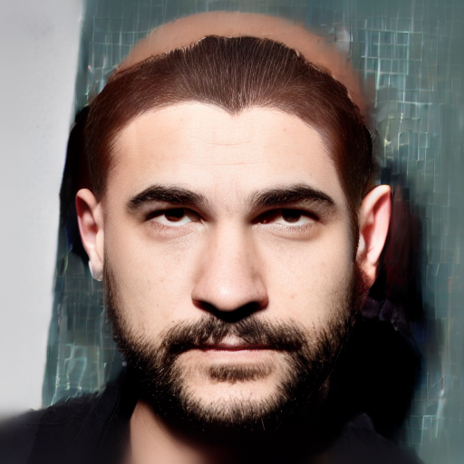 |
|  | 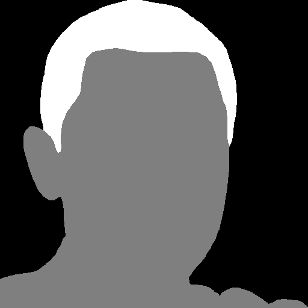 | "high quality, realistic hairstyle, detailed texture, 8k" | 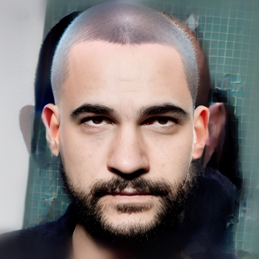 |
|  | 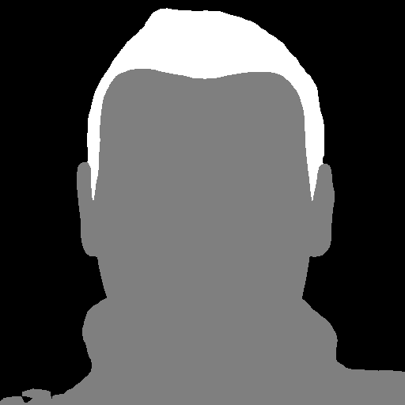 | "high quality, realistic hairstyle, detailed texture, 8k" | 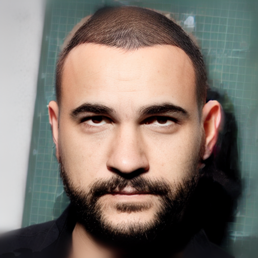 |


## 9. 실험 데이터 결과 (Test Data Results)

`test1`부터 `test5`까지의 데이터에 대한 실험 결과 정리표입니다.

| ID | 대머리 이미지 (Bald Input) | 시멘틱 마스크 (Semantic Mask) | 프롬프트 (Prompt) | 결과 이미지 (Output) |
| :---: | :---: | :---: | :--- | :---: |
| **test1** |  |  | "high quality, realistic hairstyle, detailed texture, 8k" |  |
| **test2** |  |  | "high quality, realistic hairstyle, detailed texture, 8k" |  |
| **test3** |  |  | "high quality, realistic hairstyle, detailed texture, 8k" |  |
| **test4** |  |  | "high quality, realistic hairstyle, detailed texture, 8k" |  |
| **test5** |  |  | "high quality, realistic hairstyle, detailed texture, 8k" |  |

### 9.1. 프롬프트 변화 실험 (Prompt Variation Experiment)

동일한 `test1` 입력(대머리 이미지, 시멘틱 마스크)에 대해 프롬프트만 변경하여 생성한 결과입니다.

| ID | 대머리 이미지 (Bald Input) | 시멘틱 마스크 (Semantic Mask) | 프롬프트 (Prompt) | 결과 이미지 (Output) |
| :---: | :---: | :---: | :--- | :---: |
| **test1_1** |  |  | "high quality realistic male hairstyle, low skin fade haircut, black hair, clean sides, textured top, dry matte finish, sharp hairline, natural lighting, high detail, 8k" |  |
| **test1_2** |  |  | "realistic korean male two block haircut, dark brown hair, soft volume, clean contour, slightly wavy textured fringe, natural shine, high detail, 8k" |  |
| **test1_3** |  |  | "realistic male textured crop haircut, short fringe, ash gray highlights on dark base, rough texture, slightly tousled top, modern barbershop style, cinematic lighting, ultra-detailed, 8k" |  |
| **test1_4** |  |  | "realistic male hairstyle, natural perm with soft waves, medium length fringe pushed slightly forward, subtle brown highlights, airy movement, fluffy texture, high detail, 8k" |  |
| **test1_5** |  |  | "realistic male slicked back hairstyle, blonde hair color, wet glossy texture, strong hold finish, clean sides, sharp edges, modern gentleman style, high fidelity detail, 8k" |  |

### 9.2. 프롬프트 변화 실험 - test2

동일한 `test2` 입력(대머리 이미지, 시멘틱 마스크)에 대해 프롬프트만 변경하여 생성한 결과입니다.

| ID | 대머리 이미지 (Bald Input) | 시멘틱 마스크 (Semantic Mask) | 프롬프트 (Prompt) | 결과 이미지 (Output) |
| :---: | :---: | :---: | :--- | :---: |
| **test2_1** |  |  | "high quality realistic male hairstyle, low skin fade haircut, black hair, clean sides, textured top, dry matte finish, sharp hairline, natural lighting, high detail, 8k" | 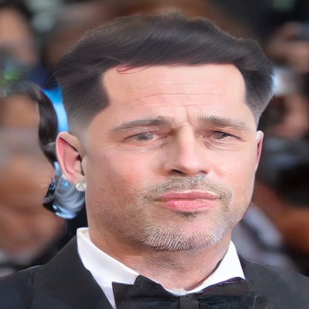 |
| **test2_2** |  |  | "realistic korean male two block haircut, dark brown hair, soft volume, clean contour, slightly wavy textured fringe, natural shine, high detail, 8k" | 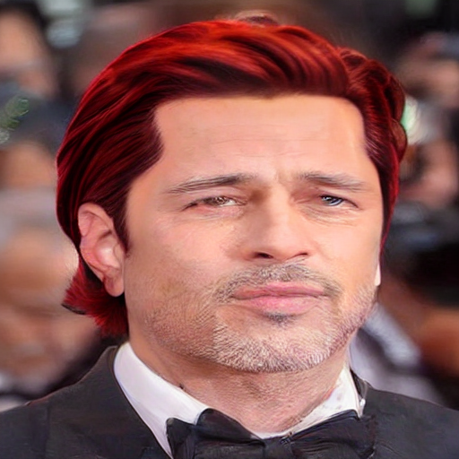 |
| **test2_3** |  |  | "realistic male textured crop haircut, short fringe, ash gray highlights on dark base, rough texture, slightly tousled top, modern barbershop style, cinematic lighting, ultra-detailed, 8k" | 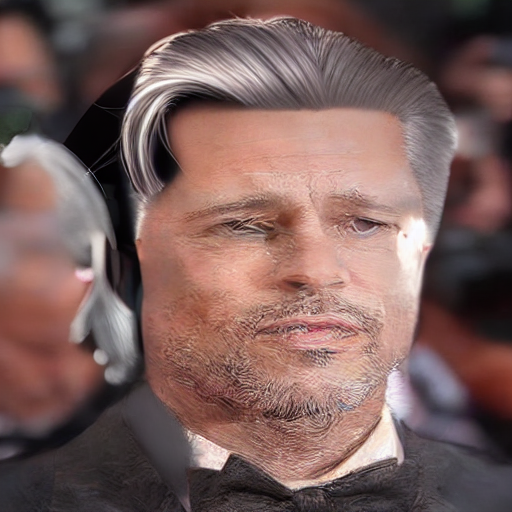 |
x   | **test2_4** |  |  | "realistic male hairstyle, natural perm with soft waves, medium length fringe pushed slightly forward, subtle brown highlights, airy movement, fluffy texture, high detail, 8k" | 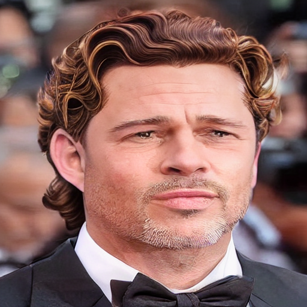 |
| **test2_5** |  |  | "realistic male slicked back hairstyle, blonde hair color, wet glossy texture, strong hold finish, clean sides, sharp edges, modern gentleman style, high fidelity detail, 8k" | 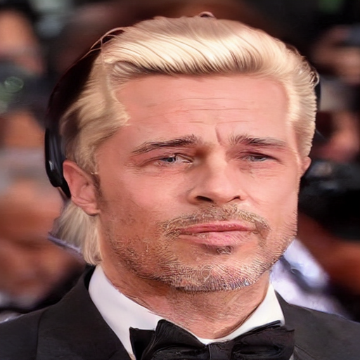 |

---

## 10. Related Works & Multi-ControlNet References
본 프로젝트와 유사하게 복수의 ControlNet을 활용하거나, 이종(Hybrid) 조건을 결합하여 제어력을 높인 연구 사례들입니다.

### 10.1. 헤어 생성 및 편집 특화 연구 (Hair Specific)
*   **Stable-Hair (2024)**:
    *   **방식**: Latent ControlNet 아키텍처 도입.
    *   **특징**: **'Bald Converter'**와 **'Latent IdentityNet'**을 결합하여 대머리 영역을 자연스럽게 채우면서 신원을 보존함.
    *   **연관성**: 본 프로젝트의 **Stream B (Identity Net)**가 이 연구의 Latent IdentityNet 개념을 채용 및 발전시킨 것임.

### 10.2. 멀티 컨트롤넷 및 퓨전 기법 (General Multi-Control)
*   **C3Net (Compound Conditioned ControlNet)**:
    *   **아이디어**: 텍스트, 이미지 등 다양한 모달리티를 하나의 통합된 Latent Space로 정렬(Alignment)시킨 후 제어.
    *   **시사점**: 서로 다른 성격의 조건(Pixel vs Latent)을 결합할 때, Latent Space에서의 정렬이 중요함을 시사.
*   **ControlNet++**:
    *   **아이디어**: Condition Transformer를 사용하여 여러 조건(Condition)을 효율적으로 융합.
    *   **시사점**: 단순 Summation(덧셈) 방식을 넘어, 조건 간의 상관관계를 고려한 Attention 기반 융합 가능성 제시.
*   **Minimal Impact ControlNet**:
    *   **아이디어**: 여러 컨트롤 신호가 충돌할 때, 텍스처 생성을 방해하는 "Silent Control" 문제를 해결하기 위한 최적화 기법.
    *   **시사점**: Geometry(강한 제약)와 Identity(약한 제약)가 충돌할 때의 균형 조절(Scale 튜닝)에 대한 이론적 근거 제공.
