# V4_2 

이 문서는 V4 단계의 추가 실험 및 리서치 내용을 정리합니다.

## 1. Natural Filter: GAN Inversion을 이용한 후처리

생성된 결과물의 어색한 부분을 보정하고 자연스러움을 극대화하기 위해 **GAN Inversion을 Natural Filter로 사용**해보는 실험을 진행하였습니다.

### 1.1. Natural Filter 효과
**"GAN Inversion을 Natural Filter로 사용"**

GAN Inversion과 Generator Reconstruction 과정을 거치면 학습된 데이터(FFHQ 등)의 분포에 맞게 이미지가 재구성되므로, 어색한 부분(얼굴-머리 경계, 부자연스러운 텍스처 등)이 자연스럽게 보정되는 **"Natural Filter"** 효과를 얻을 수 있습니다.

### 1.2. 실험 설정 가이드 (Natural Filter 적용)
이미 생성된 결과물을 자연스럽게 다듬기 위해, **VividHairStyler** UI에서 다음과 같이 설정합니다.

1.  **입력 설정**:
    *   **Source Image**: 보정할 생성 이미지
    *   **Structure Image**: 보정할 생성 이미지 (**source 와 동일 이미지**)
    *   **Appearance Image**: 보정할 생성 이미지 (**source 와 동일 이미지**)

2.  **설정 이유**:
    *   **Identity Alignment**: 세 가지 입력 조건을 동일하게 설정함으로써, 정렬 모듈(Alignment Module)이 Identity Mapping을 수행하도록 유도합니다.
    *   **Manifold Projection**: 입력 이미지는 Pre-trained StyleGAN의 Latent Space로 Projection된 후 Reconstruction됩니다. 이 과정은 이미지를 생성 모델이 학습한 **자연스러운 데이터 분포(Manifold)** 내로 강제 구속하는 효과를 가집니다.
    *   **Generative Prior Regularization**: 결과적으로 Diffusion 생성 과정에서 발생할 수 있는 미세한 불연속성이나 아티팩트(Out-of-Distribution Noise)가 StyleGAN의 **Generative Prior**에 의해 Regularization되어, **Natural Filter** 효과를 얻게 됩니다.

### 1.3. 실험 결과

v4_test_semantic 결과(Input), GAN Inversion 결과(Natural Filter), 그리고 이마라인 비교를 위한 마스크들을 나열합니다.

| ID | V4 Output | V4 + GAN-Inversion | Semantic Mask | Extracted Mask |
| :---: | :---: | :---: | :---: | :---: |
| **test1** | 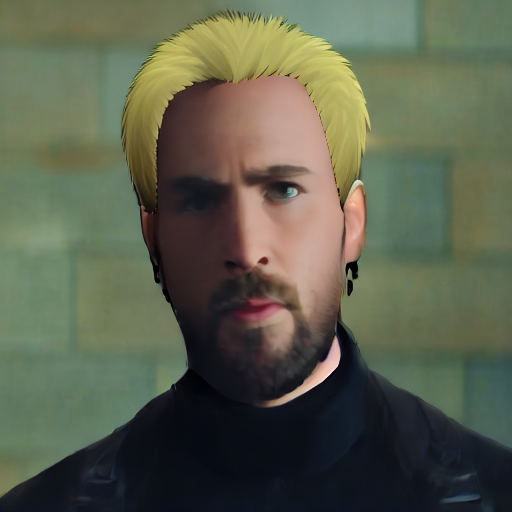 | 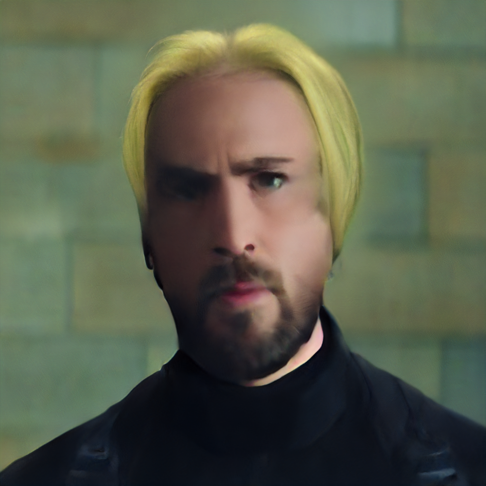 | 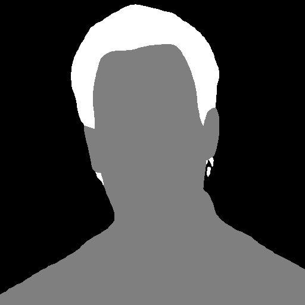 | 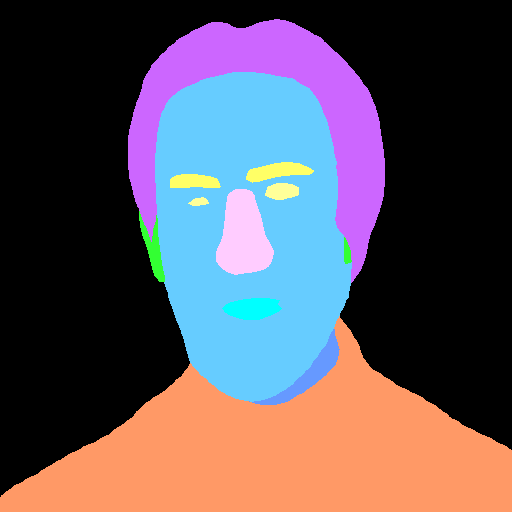 |
| **test2** | 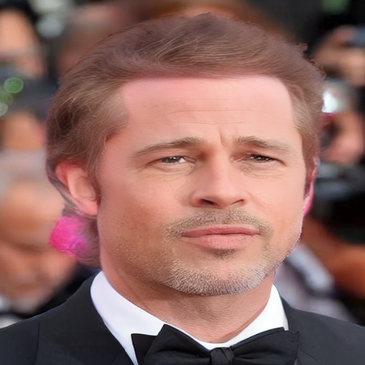 | 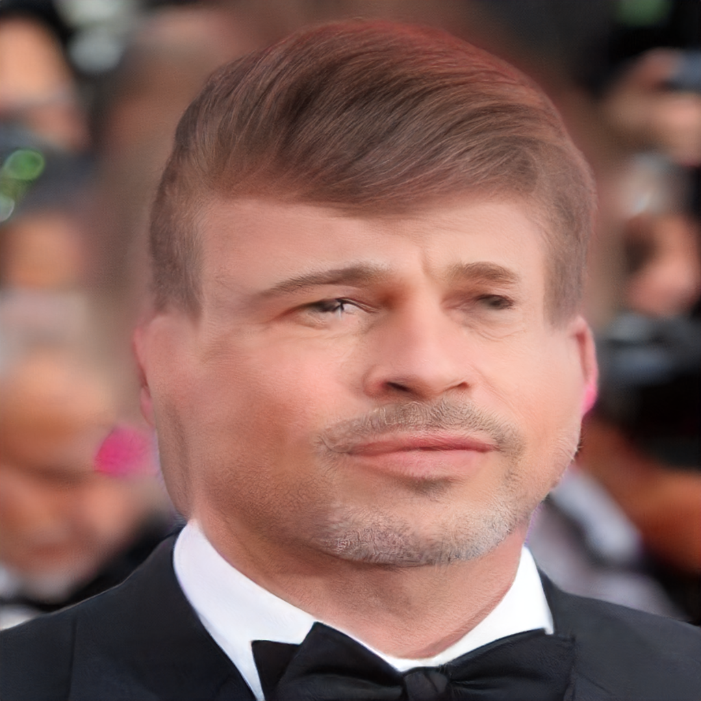 | 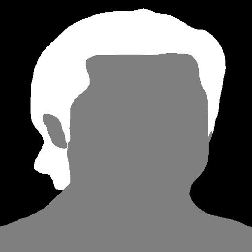 | 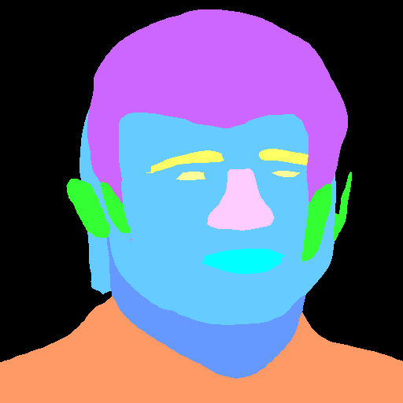 |
| **test3** | 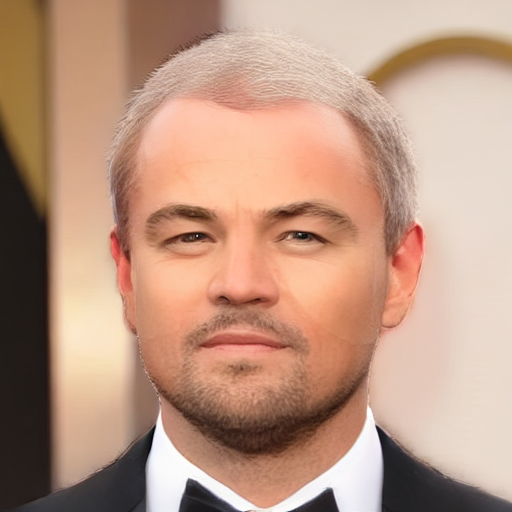 | 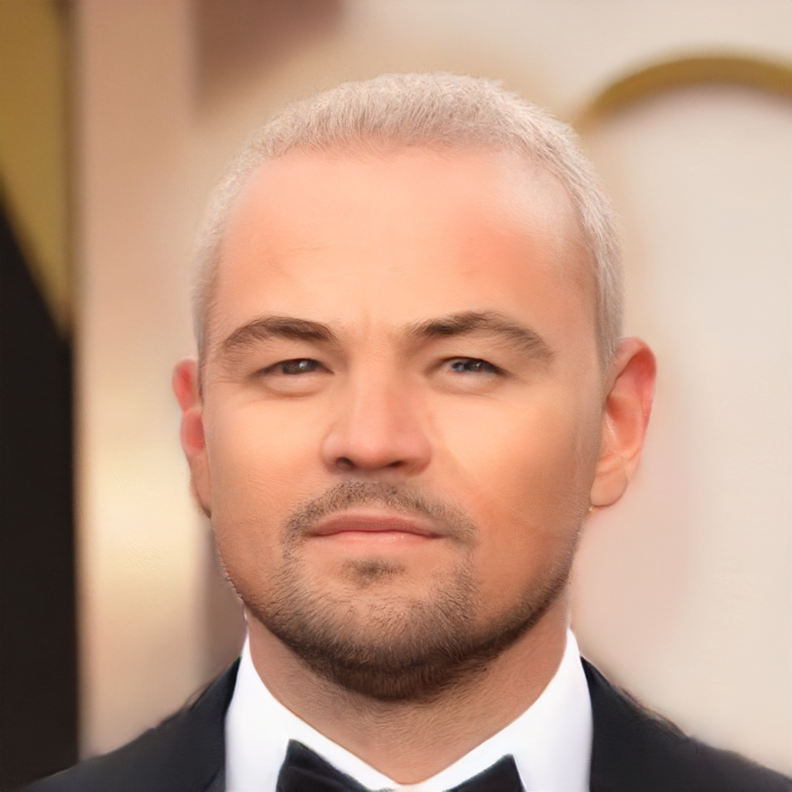 | 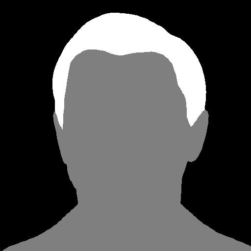 | 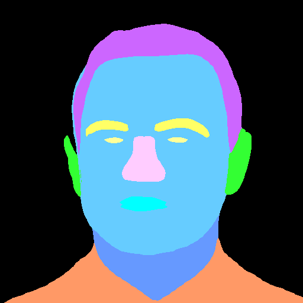 |
| **test4** | 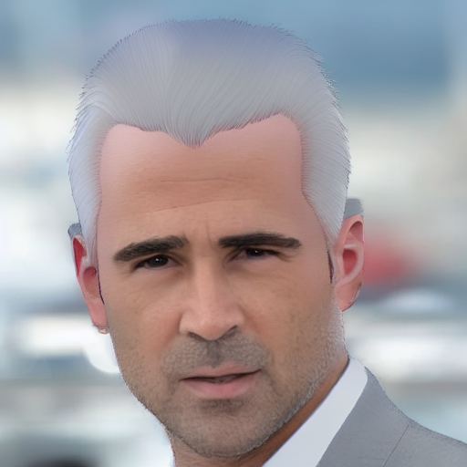 | 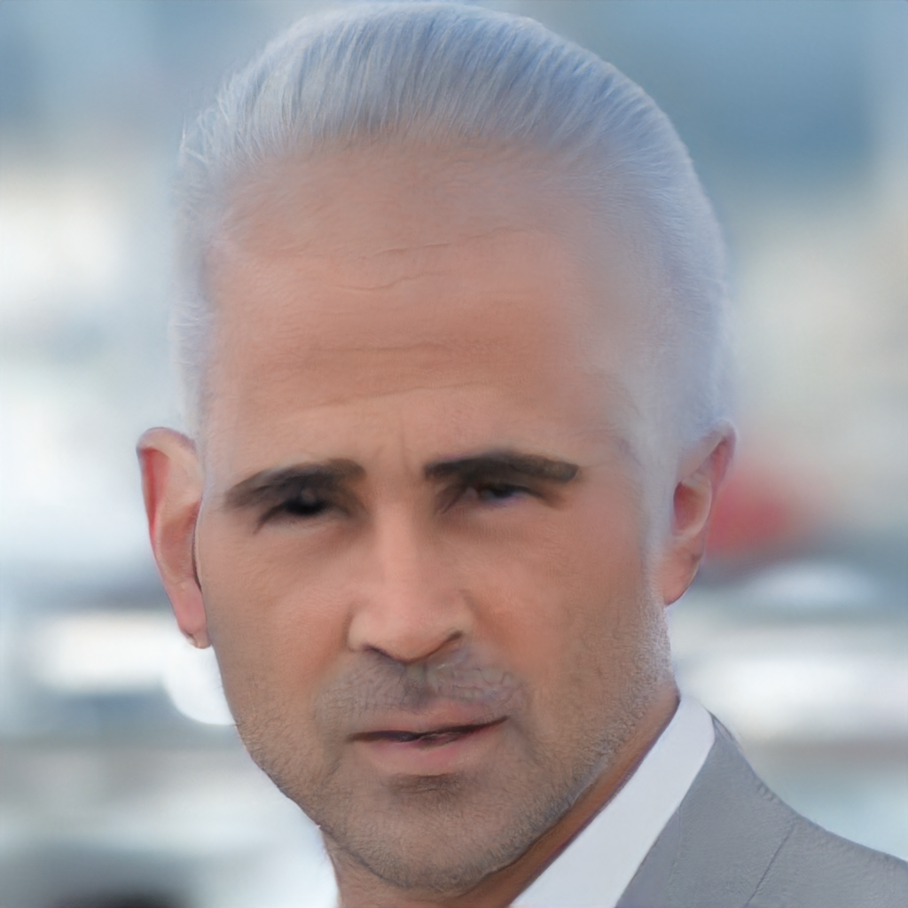 | 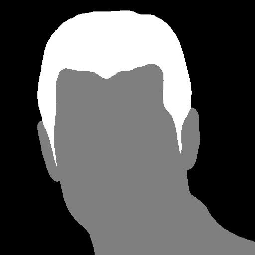 | 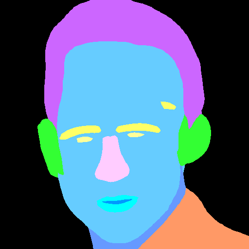 |
| **test5** | 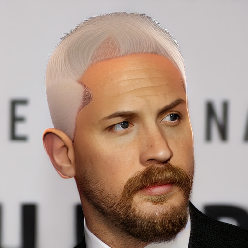 | 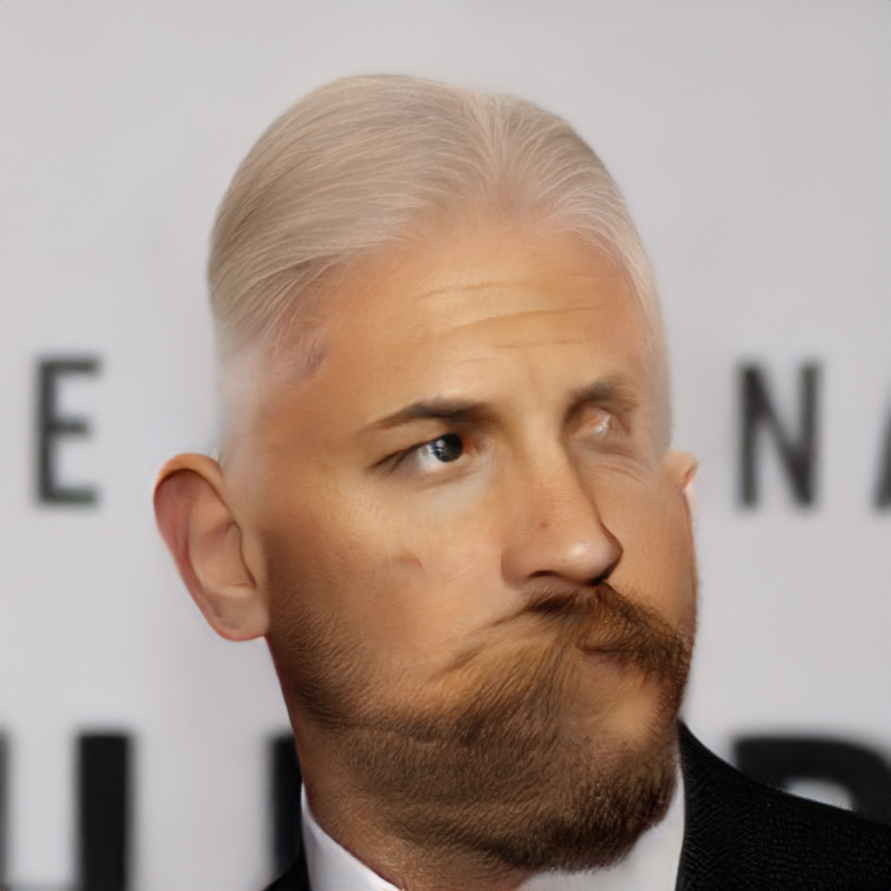 | 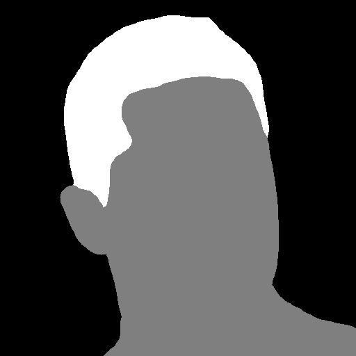 | 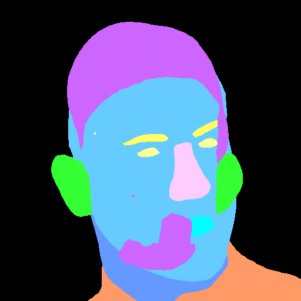 |

---

## 2. Hair Color Control Mechanism in Diffusion

Diffusion 모델에서 특정 영역(머리카락)의 색상을 정교하게 제어하기 위한 메커니즘 분석 및 제안입니다.

### 2.1. Cross-Attention Control (Prompt-to-Prompt)
Stable Diffusion과 같은 모델은 **Cross-Attention Map**을 통해 텍스트 프롬프트와 이미지의 공간적 위치를 연결합니다. 머리카락 색상을 제어하는 핵심 원리는 이 Attention Map을 조작하는 것입니다.

*   **원리**: 
    *   UNet의 각 레이어에서 `Query`(Image Feature)와 `Key`(Text Embedding) 간의 유사도를 계산하여 Attention Map을 생성합니다.
    *   예를 들어 `"blonde hair"`라는 프롬프트에서 `blonde` 토큰은 머리카락 위치에 높은 Attention 값을 가집니다.
*   **제어 기법**:
    1.  **Refinement (Token Weighting)**: 프롬프트에서 색상 단어의 가중치를 높입니다 (예: `(blonde hair:1.3)`). 가장 단순하지만, 피부색이나 배경색에 간섭(Color Bleeding)이 발생할 수 있습니다.
    2.  **Attention Swap (P2P)**: 기존 이미지의 구조(Geometry)를 유지하면서 색상만 바꾸고 싶을 때, 생성 과정(Timestep $t$) 중 초기 단계의 Cross-Attention Map은 고정한 채로, `Color Token`에 해당하는 Map만 교체합니다.
    3.  **Local Blend**: `Hair Mask`를 활용하여, 마스크 영역 내부에는 "Red Hair" 프롬프트의 Latent를, 외부에는 원본 프롬프트의 Latent를 섞어서 노이즈를 예측하게 합니다.

### 2.2. 제안: Semantic Attention Guidance
우리는 이미 정교한 **Semantic Mask(Hair)**를 가지고 있으므로, 이를 Attention 제어에 직접 활용하는 것이 가장 효과적입니다.

**제안하는 Attention 수식**:
$$
\text{Attn}_{new} = \text{Attn}_{color} \odot M_{hair} + \text{Attn}_{orig} \odot (1 - M_{hair})
$$

*   **구현 방안**:
    *   **입력**: Semantic Mask (Hair 영역).
    *   **과정**: Cross-Attention 연산 시, 색상 관련 토큰(예: "Blue", "Red")의 Attention Map이 생성될 때 강제로 Semantic Mask 영역 밖의 값을 0으로 억제(Masking)하거나, Loss를 주어 정렬시킵니다.
### 2.3. 현상 분석: 머리 색이 배경색을 따라가는 이유 (Color Bleeding Analysis)
**현상**: 프롬프트에 특정 머리 색(예: "Black hair")을 지정하지 않으면, 생성된 머리카락이 **배경색(Background Color)과 유사한 톤**으로 생성되는 경향이 관찰됩니다.

**원인 분석**:
1.  **Img2Img Initialization (초기값의 영향)**:
    *   현재 V4 추론(`infer_hairline_cond_v4.py`)은 완전한 Random Noise에서 시작하는 것이 아니라, **대머리 이미지($z_{bald}$)에 노이즈를 섞은 상태($z_T$)**에서 시작하는 **Image-to-Image** 방식을 사용합니다.
    *   비록 `noise_strength=0.9`로 높은 노이즈를 주더라도, Latent Space 내에는 원본 대머리 이미지의 **배경색 정보(Global Tone)**가 잔존해 있습니다.
2.  **Contextual Harmonization (맥락적 조화)**:
    *   Diffusion 모델은 빈 공간(Inpainting 영역)을 채울 때, 주변 영역(Context)과 가장 이질감이 적은 색상을 선택하려는 **Harmonization Bias**가 있습니다.
    *   강력한 색상 프롬프트(Condition)가 부재할 경우, 모델은 주변 배경색과 가장 "어울리는(=비슷한)" 색상을 '정답'으로 추론하여 부드럽게 이어지게 만듭니다.

**결론**: 즉, 명확한 지시어가 없으면 모델은 **"배경과 튀지 않는 가장 안전한 색(배경색)"**을 선택하는 것이 자연스럽다고 판단하기 때문입니다.

### 2.4. 해결 방안: Diffusion Level Control
교수님의 조언대로, 이는 모델 재학습 없이 **Diffusion Inference 단계**에서 충분히 제어 가능합니다. 핵심은 **"Cross-Attention"**을 우리가 가진 **"Semantic Mask"**로 구속(Guidance)하는 것입니다.

1.  **Mask-Guided Cross-Attention (가장 확실한 방법)**:
    *   **개념**: 텍스트 프롬프트에서 색상 토큰(예: "Black", "Brown")이 생성하는 Attention Map이 **오직 Semantic Mask(머리카락 영역)** 내부에서만 활성화되도록 강제합니다.
    *   **메커니즘**:
        $$ \text{Attention}(Q, K, V)_{color\_token} \leftarrow \text{Attention}(Q, K, V)_{color\_token} \times \text{Mask}_{hair} $$
    *   **효과**: 배경색($z_{bald}$의 영향)이 아무리 강해도, Attention이 머리카락 마스크 영역에 "Black" 정보를 강력하게 주입하므로 배경색을 덮어쓰고 원하는 색이 발현됩니다.
    
2.  **Regional Prompting (영역별 프롬프트)**:
    *   **개념**: 이미지 영역을 분할하여 서로 다른 프롬프트를 적용합니다.
    *   **적용**: 
        *   **Background ($1 - Mask$)**: "Original background, consistent lighting"
        *   **Hair ($Mask$)**: "Black hair, high detailed texture"
    *   이렇게 하면 배경은 유지하면서 머리카락 영역만 독립적인 색상 텍스트 조건을 갖게 되어 배경색 간섭(Bleeding)을 끊을 수 있습니다.


---

## 3. 나노바나나 비교실험

나노바나나를 활용하여 헤어라인 보존 및 성능을 V4 실험과 비교하기 위한 실험 환경을 구성하였다. V4 추론 시 사용된 조건과 동일한 환경을 구성하였다

### 3.1. 실험 구성
*   **목적**: 동일한 프롬프트와 입력을 사용했을 때 V4 모델과의 성능 비교, 특히 **헤어라인**의 디테일 보존 능력 확인.
*   **입력**:
    1.  **Bald Image** : V4 추론 시 사용된 Bald Image
    2.  **Semantic Mask**: 이마라인을 보존능력을 위한 마스크

### 3.2. 프롬프트 및 요청문구 

*   요청 문구(gemini가 만듬)
    > "제공된 **대머리 이미지(Bald Image)**와 **시멘틱 마스크(Semantic Mask)**를 사용하여 헤어스타일을 생성해줘.
    > 다음 생성 원칙을 **엄격하게** 지켜야 해:
    > 1.  **Geometry (Mask Strictness)**: 마스크의 **White Area(머리카락 영역)**는 정확한 헤어라인 가이드야. 마스크의 경계선(이마 라인, 구렛나루 등)을 픽셀 단위로 정확하게 따르고, 마스크 영역 밖으로 머리카락이 넘치거나 안쪽이 비어선 안 돼. (Pixel-perfect adherence required)
    > 2.  **Identity (Background Preservation)**: 마스크가 검은색인 영역(얼굴, 배경)은 대머리 이미지 원본을 **그대로 보존**해야 해. 얼굴이 바뀌거나 왜곡되면 안 돼.
    > 3.  **Style**: 텍스트 프롬프트에 명시된 스타일(e.g., Realistic, 8k)로 머리카락 텍스처를 마스크 영역 안에 채워줘."

*   **Prompt (Default)**:
    ```text
    high quality, realistic hairstyle, detailed texture, 8k
    ```

### 3.4. 실험 결과

| ID | V4 Output | V4 + GAN-Inversion | Nano Banana |
| :---: | :---: | :---: | :---: |
| **test1** |  |  | 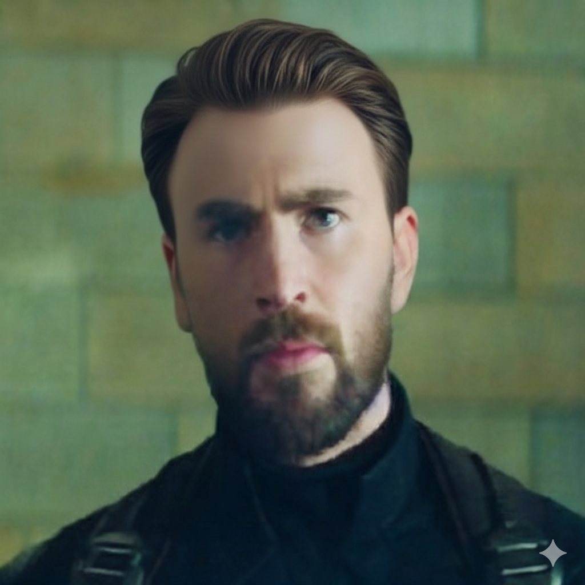 |
| **test2** |  |  | 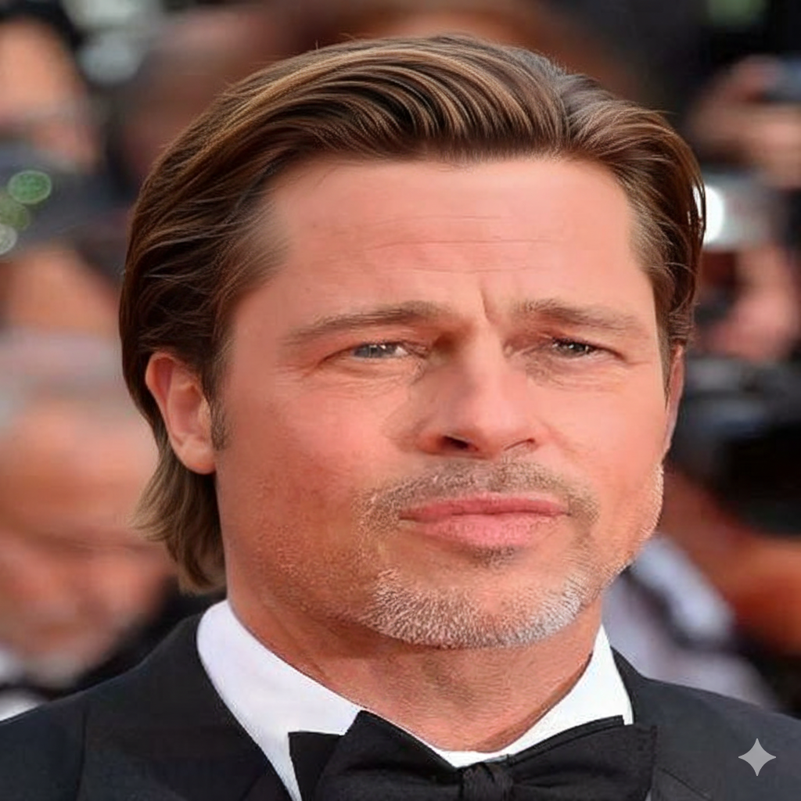 |
| **test3** |  |  | 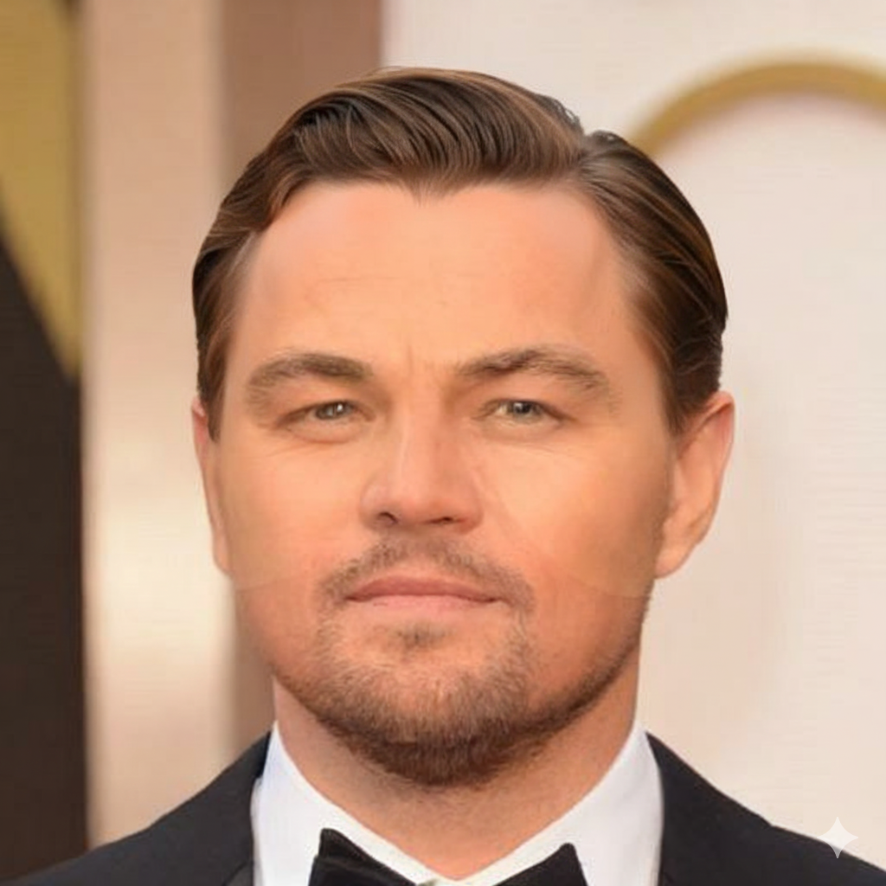 |
| **test4** |  |  | 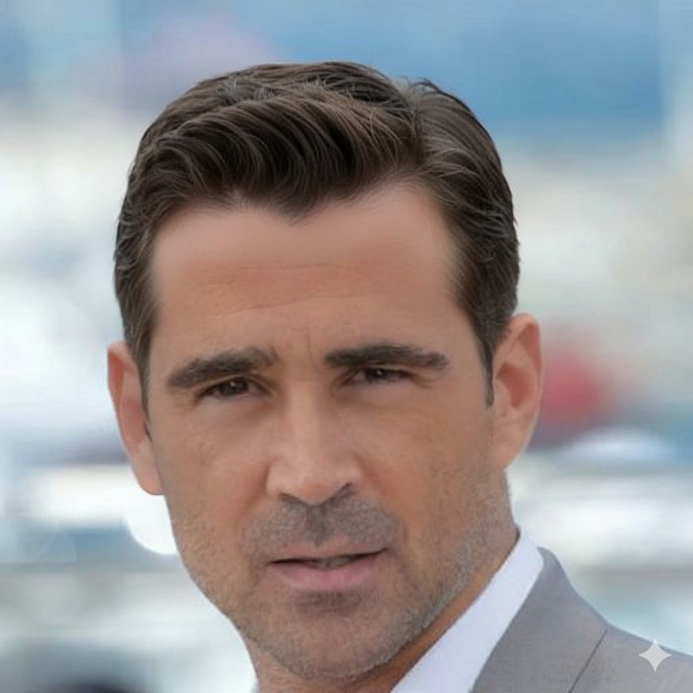 |
| **test5** |  |  | 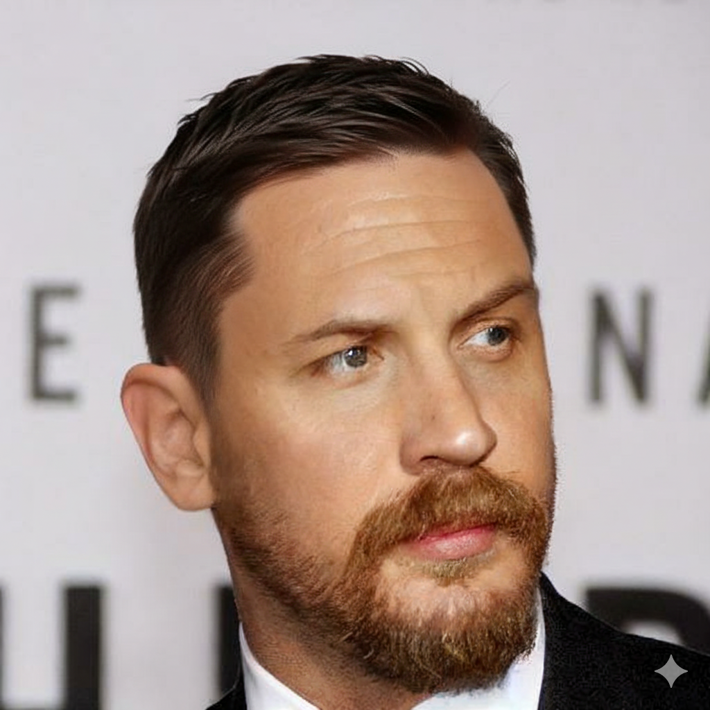 |

#