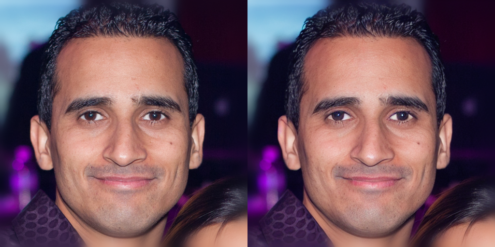
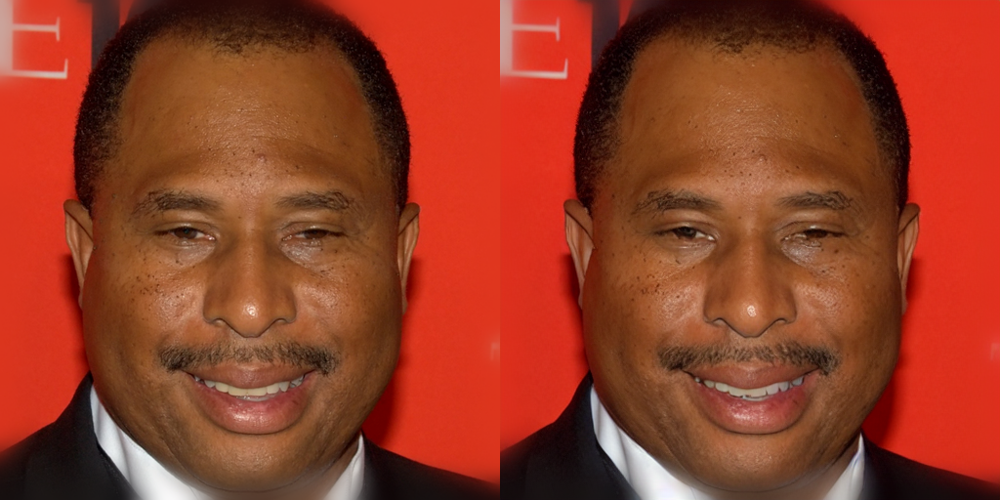
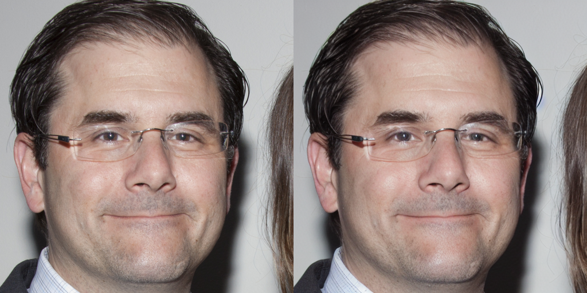
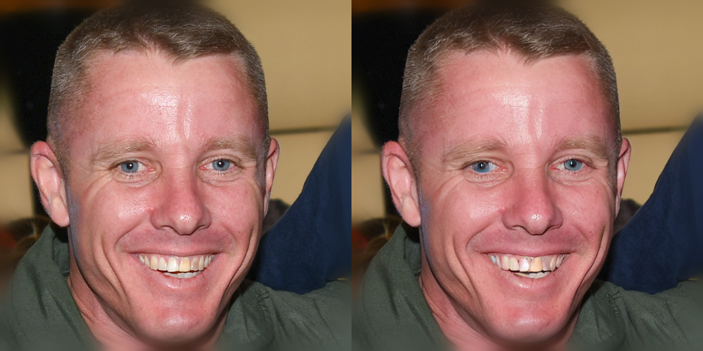

# VAE 재구성 실험

## 1. 목표 (Goal)
Stable Diffusion(v1.5)에서 사용하는 기본 VAE가 **뾰족한 머리카락(spiky hair)**, **날카로운 엣지(edge)**, **High-Frequency 세부 텍스처**를 얼마나 잘 보존하는지 평가한다.

이를 위해 원본 이미지와 VAE 재구성 이미지를 비교하여, 다음을 구분하는 것이 목적이다:
- VAE 단계에서 이미 디테일이 사라지는지
- 아니면 VAE는 충분히 살리는데 이후 Diffusion/UNet 단계에서 문제가 생기는지

## 2. 변경 사항 (Proposed Changes)

### (A) 신규 스크립트 추가
- **파일 경로**: `experiment_vae_reconstruction.py` (루트 디렉토리)
- **기능 요약**:
    - Stable Diffusion v1.5의 VAE(AutoencoderKL)를 로드
    - 입력 이미지 디렉토리를 순회하며 **[원본 → VAE 인코딩 → 디코딩 → 재구성 이미지]**를 생성
    - [원본 | 재구성] 형태의 그리드 이미지를 저장

### (B) 사용 모델
- **사용 모델**: `runwayml/stable-diffusion-v1-5`의 VAE (AutoencoderKL) 

### (C) 함수 설계: `reconstruct_image(image_path, vae, device="cuda")`
- **입력**:
    - `image_path`: 원본 이미지 경로
    - `vae`: 로드된 AutoencoderKL 인스턴스
    - `device`: "cuda"
- **동작**:
    - 이미지를 로드 (PIL)
    - 512x512 기준으로 resize/center crop
    - `torch.Tensor`로 변환 및 정규화 ([-1, 1] 범위)
    - `vae.encode()`로 latent 추출 (z)
    - `vae.decode(z)`로 다시 이미지를 복원
    - 복원 이미지를 PIL.Image로 변환하여 반환
- **출력**: `(original_pil, reconstructed_pil)` 또는 두 이미지를 합친 그리드 이미지

### (D) 메인 루프 (Main Loop)
- **대상 디렉토리**: `input_dir` 내의 이미지들(.png, .jpg 등)
- **동작**:
    - 각 이미지에 대해 `reconstruct_image(...)` 호출
    - [원본 | 재구성] 형태의 가로 그리드 이미지 생성
    - `outputs/vae_reconstruction/` 아래에 `originalname_recon.png` 형태로 저장

## 3. 검증 계획 (Verification Plan)

### 테스트 실행
- 샘플 이미지 세트에 대해 스크립트 실행:
  ```bash
  python experiment_vae_reconstruction.py --input_dir data/original_images
  ```


## 4. 실험 결과 (Experiment Results)

다음은 `runwayml/stable-diffusion-v1-5` VAE를 사용하여 원본 이미지를 재구성한 결과입니다. (좌: 원본, 우: 재구성)


*Image 1: 01097.png Reconstruction*


*Image 2: 02663.png Reconstruction*


*Image 3: 04467.png Reconstruction*


*Image 4: 08061.png Reconstruction*


*Image 5: 09035.png Reconstruction*

### 결과 해석

Stable Diffusion v1.5 기본 VAE는 ‘헤어라인의 날카로운 모양(고주파 디테일)’을 상당 부분 유지하고 있다. 즉, VAE 단계에서는 뾰족한 형태가 거의 잘 유지된다.

그러므로 세부적인 디테일을 살리지 못하는 부분은 UNet / Conditioning(입력 정보 부족) 단계에서 발생하는 것이다. 

