# Hairline-Conditional Stable Diffusion

## 기술 요약서
### 1. UNet 입력 확장: 4채널 → 5채널

#### 개요

기존 Stable Diffusion의 UNet은 VAE latent인 [B, 4, 64, 64] 입력만 받을 수 있습니다.
여기에 1채널 hairline mask를 추가하여 총 5채널 입력을 처리할 수 있도록 구조를 확장했습니다.

#### Forward 수정 내용

unet_2d_condition.py의 UNet2DConditionModel.forward()에서 hair_mask 인자를 새로 받도록 수정했습니다.

mask가 들어오면:

latent 해상도 (64×64)로 resize

latent 4채널 z와 concat하여 [B, 5, 64, 64] 형식으로 변환

모델이 5채널 입력 구조인데 mask가 없을 경우에는 오류를 발생시키도록 해 기존 파이프라인과 혼동되지 않게 했습니다.

#### 첫 번째 Conv 가중치 확장 방식

utils/hair_mask_utils.py에 enable_hairline_conditioning() 함수를 추가했습니다.

이 함수는 다음을 수행합니다:

UNet 첫 Conv(기존 4ch)를 5ch로 확장

기존 pretrained weight는 그대로 보존

새로 생긴 1채널의 weight는 0으로 초기화

확장 여부를 unet.config에 기록하여 중복 확장을 방지

이 방법은 pretrained SD v1-5 가중치를 망가뜨리지 않고 그대로 사용하면서 mask 기반 conditioning을 추가할 수 있게 해줍니다.

### 2. Dataset 구성: Bald 이미지 + Hairline Mask 매칭
#### 구현 파일

utils/hairline_dataset.py

#### 주요 기능

파일명(stem 기준)을 사용해 bald 이미지와 mask를 자동으로 매칭

- 이미지: Stable Diffusion 표준 normalize 범위인 [-1, 1]으로 변환

- mask: 
    [0, 1] 범위로 clamp
    1채널 단일 mask

- 텍스트 프롬프트가 필요할 경우:.json, .jsonl, .csv에서 key 지정 (--metadata_text_key)

→ 이 Dataset을 통해 Bald + Mask + Text Prompt 세 가지 정보를 안정적으로 불러올 수 있습니다.

### 3. 학습 파이프라인: train_hairline_cond.py
#### 개요

Hairline conditioning 학습을 완전히 독립된 entry point에서 수행할 수 있도록 새로운 학습 스크립트를 작성했습니다.

#### 지원 인자

--bald_dir, --mask_dir, --metadata_path

--batch_size, --lr, --num_epochs, --output_dir

--pretrained_model_name_or_path runwayml/stable-diffusion-v1-5

#### 학습 흐름

1. Stable Diffusion v1-5의 VAE, text encoder, scheduler 로딩
2. UNet 로딩 뒤
    - enable_hairline_conditioning()으로 5채널 입력 구조 활성화

3. Dataset 로딩

4. mask를 latent 해상도 (64×64)로 resize

5. UNet.forward() 호출 시 hair_mask=mask_latent 전달

6. DDPM noise prediction loss (MSE) 그대로 적용

7. accelerate 기반 multi-GPU 또는 single-GPU 학습

8. 최종 checkpoint는 <output_dir>/unet에 저장

→ Hairline mask 기반 conditioning을 완전히 지원하는 학습 루프가 구축됨.

### 4. 추론 파이프라인: infer_hairline_cond.py
#### CLI 예시
python infer_hairline_cond.py \
    --model_dir runs/hairline_cond/unet \
    --bald_path Bald.png \
    --mask_path Mask.png \
    --prompt "short text" \
    --out_dir samples

#### 동작 과정

bald 이미지 로딩 → 512×512 normalize [-1,1]

mask 로딩 → 512×512 normalize [0,1]

둘 다 latent로 encode

mask는 64×64로 다운샘플

z와 mask latent concat → [B,5,64,64]

DDIM sampling 또는 img2img-strength 기반 reverse diffusion

VAE Decoder로 RGB 이미지 생성

PNG로 저장

#### 옵션

CFG scale

sampling steps

noise strength

seed

출력 이미지 개수

### 5. 전체 요약

본 작업은 Stable Diffusion의 UNet을 확장해 4채널 latent + 1채널 hairline mask로 구성된 5채널 입력 구조를 도입함으로써, 구조적 제약을 명확히 제공할 수 있는 hairline-conditional pipeline을 완성한 것이다.

또한,

- Conv weight 확장

- dataset 구축

- 독립된 학습 스크립트(train_hairline_cond.py)

- 독립된 추론 스크립트(infer_hairline_cond.py)

까지 포함하여,
**“대머리 이미지 + 이마라인 mask → 현실적 헤어 생성”**이라는 목적을 달성할 수 있는 end-to-end 시스템 전체가 완성되었다.

### visualize_latents.py 스크립트 추가.
- Stable Diffusion VAE를 사용해
    - 원본 이미지
    - 대머리 이미지

를 각각 64*64*4 latent 공간으로 인코딩하고

- 각 채널을 컬러 히트맵으로 저장되도록 구현됨
- 원본/대머리 latent의 구조 차이를 직접 눈으로 확인하는 목적

#### 실행 명령어(예: 01047.png)
> python scripts/visualize_latents.py \
    --pretrained_model_name_or_path runwayml/stable-diffusion-v1-5 \
    --image_a data/original_images/01047.png \
    --image_b data/bald_images/01047.png \
    --out_dir latent_viz/01047 \
    --save_npz

#### latent_original.png
- 원본 이미지를 VAE encode한 latent
- 4개 채널(c0-c3)을 각각 heatmap으로 시각화한 합성 이미지
- 어느 위치에 정보가 집중되는 지 바로 확인가능

#### latent_bald.png
- 대머리 이미지를 encode 한 latent
- hair 영역의 정보가 어떻게 달라지는 지 확인 가능 

#### latent_original vs latent_bald
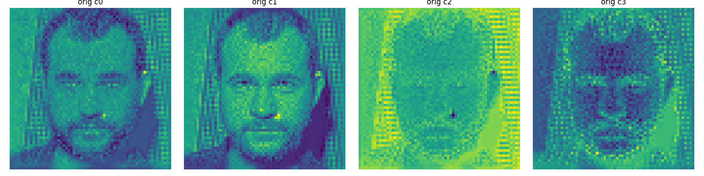
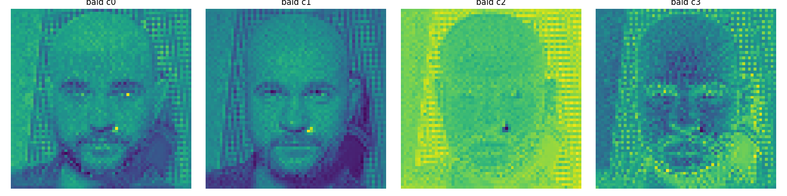

### 머리 마스크 생성
- 입력 이미지 : 원본 이미지 216장
    - 크기 : 512 * 512
    - 포맷 : png
- 샤용 모델 :
    - BiseNet(16-class) face-parsing 네트워크
    - 체크포인트 : models/face_segment16.pth

- 처리 내용

1. data/myset/images/*.png에 대해 BiSeNet 추론 수행
2. 16개의 클래스 중 머리(hair) 클래스에 해당하는 픽셀만 1, 나머지는 0으로 두어 hair-only binary mask 생성
3. 생성된 hair-mask를 아래 경로에 저장 : 
    - data/myset/mask_hair/*.png

> root@1dbf51428591:/workspace/HairFusion2# python - <<'PY' > import torch > from torchvision import transforms > from torchvision.utils import save_image > from PIL import Image > from pathlib import Path > from models.face_parsing.model import BiSeNet > from utils import get_seg, get_seg_mask set_nam> > set_name = 'myset' > images_dir = Path('data') / set_name / 'images' > mask_dir = Path('data') / set_name / 'mask_hair' > mask_dir.mkdir(parents=True, exist_ok=True) > > image_paths = sorted([p for p in images_dir.iterdir() > if p.suffix.lower() in {'.png', '.jpg', '.jpeg', '.bmp'}]) t(f'Fo> print(f'Found {len(image_paths)} images under {images_dir}') > if not image_paths: > raise SystemExit('No images found to segment.') > > device = torch.device('cuda' if torch.cuda.is_available() else 'cpu') > print(f'Using device: {device}') > seg_model = BiSeNet(n_classes=16).to(device) > seg_model.load_state_dict(torch.load('models/face_segment16.pth', map_location=device)) > seg_model.eval() > > transform = transforms.Compose([ > transforms.Resize((512, 512)), > transforms.ToTensor() > ]) > > with torch.no_grad(): > for idx, image_path in enumerate(image_paths, 1): ima> image_raw = Image.open(image_path).convert('RGB') > image_seg_input = transform(image_raw).unsqueeze(0).to(device) > image_seg_output, _ = get_seg(seg_model, image_seg_input, image_seg_input.shape[2:], sigmoid=True) > mask_hair = get_seg_mask(image_seg_output, region='hair')[0] > save_image(mask_hair, mask_dir / image_path.name, normalize=True) > > # 처리 진행 - 출력 추가 > if idx % 10 == 0 or idx == len(image_paths): > print(f'Processed {idx}/{len(image_paths)}: {image_path.name}') air mask> generation comp> print('Hair mask generation completed.') > PY

### 이마라인 마스크 생성
- 입력 : 
    - 이전 단계에서 생성된 hair mask :
        data/myset/mask_hair/*.png
- Morpholohy 파이프라인 : 
1. 내부 축소 (erosion)

    - 파라미터: hair_erode = 19

    - 의미 : hair 영역을 안쪽으로 크게 축소하여, “안쪽 core hair 영역”만 남기기.

2. 경계 밴드 추출 (difference)

    - 원본 hair mask와 erode된 mask의 차집합을 계산.

    - hairline_band = hair_mask - hair_eroded

    - 이 밴드는 hair 영역의 “외곽 경계”에 해당하는 얇은 띠를 의미.

3. 두께 보정 (dilation)

- 파라미터: hairline_dilate = 5

- 위에서 얻은 경계 밴드를 약간 확장하여,
너무 얇은 선이 되지 않도록 적당한 두께를 가진 hairline band로 보정.

- 출력 : 최종 미사선(hairline) 마스크를 아래에 저장:
    - data/myset/forehead_line/*.png
    - 형식 :  1채널 마스크

> root@1dbf51428591:/workspace/HairFusion2# python - <<'PY' > from pathlib import Path > import numpy as np > from PIL import Image, ImageFilter > > set_name = 'myset' > mask_dir = Path('data') / set_name / 'mask_hair' > out_dir = Path('data') / set_name / 'forehead_line' > out_dir.mkdir(parents=True, exist_ok=True) > > threshold = 0.5 > hair_erode = 19 > hairline_dilate = 5 > > def positive_odd(value): return value if value % 2 == 1 else value + 1 > > def load_binary(path): > arr = np.array(Image.open(path).convert('L'), dtype=np.float32) / 255.0 return> return arr >= threshold > > def morph(mask, size, filt): > if size <= 1: return mask > img = Image.fromarray((mask.astype(np.uint8)) * 255) > return np.array(img.filter(filt(positive_odd(size))), dtype=np.uint8) > 0 > > hair_paths = sorted(mask_dir.glob('*.png')) > if not hair_paths: > raise RuntimeError(f'No PNG masks in {mask_dir}') > print(f'Processing {len(hair_paths)} masks from {mask_dir}') > > for idx, hair_path in enumerate(hair_paths, 1): > hair_mask = load_binary(hair_path) > eroded = morph(hair_mask, hair_erode, ImageFilter.MinFilter) > hairline = np.logical_and(hair_mask, np.logical_not(eroded)) > hairline = morph(hairline, hairline_dilate, ImageFilter.MaxFilter) > Image.fromarray((hairline.astype(np.uint8)) * 255).save(out_dir / hair_path.name) > if idx % 25 == 0 or idx == len(hair_paths): p> print(f'Saved {idx}/{len(hair_paths)} -> {out_dir / hair_path.name}') > > print('Done generating forehead-line masks.') > PY

  
  
  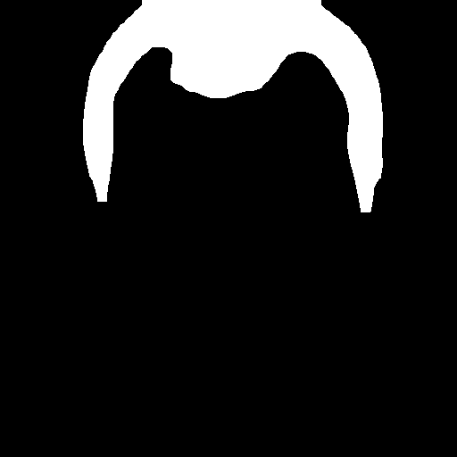
  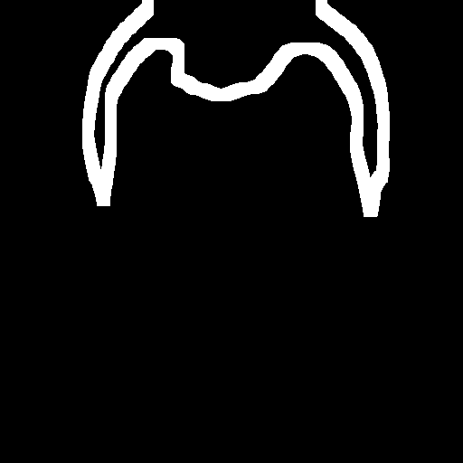

  
  
  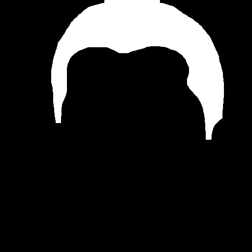
  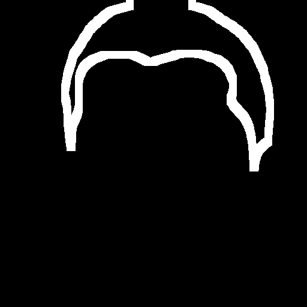

  
  
  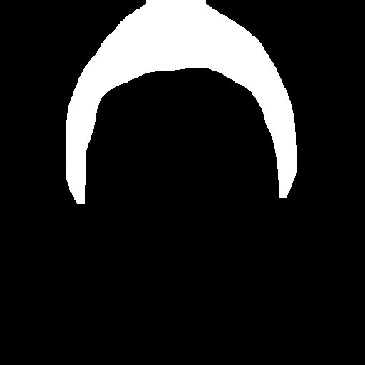
  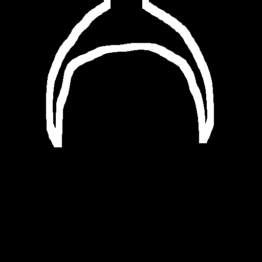

### 이마부분 hairline만 살릴 수는 없을까?

extract_forehead_hairline.py

#### 헤어마스크 정제 및 헤어라인 추출 과정(5단계)

1. 파싱 맵 생성(BiSeNet)

    - 16가지 클래스를 가진 BiSeNet 모델을 실행하여 이미지의 파싱맵을 얻습니다.

2. 이마 관련 마스크 생성 및 정제

    - 피부 / 얼굴 레이어로 부터 forehead_related_mask를 생성하고, 이 마스크를 팽창시킨다
    - 이 후 눈썹 높이와 열 패딩을 사용하여 마스크의 영역을 제한하여 정면 밴드만 남도록 한다

3. 정면 헤어 마스크 추출

    - 2단계에서 생성된  forehead_realted_mask를 곱한다.
    - 이로 인해 mask_hair는 이제 주변의 정면 헤어만 포함하게 된다./

4. 헤어라인 밴드 계산 :
    - 제한된 mask_hair로 부터 헤어라인 밴드를 계산한다.

    - 침식 : 마스크를 침식시킨다(기본값 : hair_erode=19)
    - 차이 계산 : (헤어 마스크 - 침식 마스크)를 계산하여 경계를 추출한다
    - 팽창 : 추출된 경계를 팽창시켜 밴드의 두께 확보 ( hairline_dilate = 5)
    - 팽창 시키는 이유 : 
        - 픽셀 경계의 모호성 및 오류
            헤어라인은 머라카락과 얼굴피부가 만나는 1픽셀 너비의 경계임.
            - 정확도 : BiSeNet 모델은 완벽하지 않음. 픽셀을 머리카락으로 볼지, 피부로 볼지 오분류 가능성
            - 손실 방지 : 팽창은 이러한 1~2픽셀의 오차를 수용하고, 후속 처리를 위해 경계 정보 유실되지 않도록 보장
        - 후속 모델(Diffusion)의 학습 용이성
        이 헤어라인 마스크는 최종적으로 이미지 합성 또는 복원 모델의 컨디셔닝 입력으로 사용된다. 
            - 정보 밀도 
            - 견고성 확보

5. 결과 저장

    - 이마 전용 헤어 마스크 / 최종 1채널 헤어라인 마스크 생성
    - 헤어라인 마스크는 확산 모델 및 U-Net 컨디셔닝을 위한 최종 경계 마스크 ㅇ

>>PYTHONPATH=/workspace/HairFusion2 python scripts/extract_forehead_hairline.py \
    --set-name myset \
    --hair-erode 19 \
    --hairline-dilate 5 \
    --forehead-dilate 61 \
    --forehead-brow-margin 5 \
    --forehead-column-margin 20

                                   개선전                                                    개선 후

  
  
  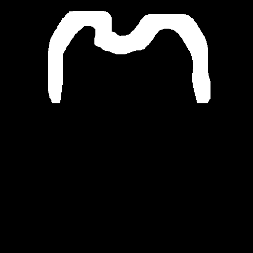
  

  
  
  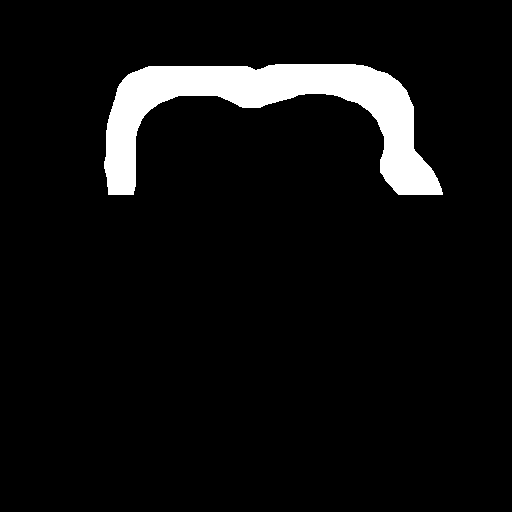
  

  
  
  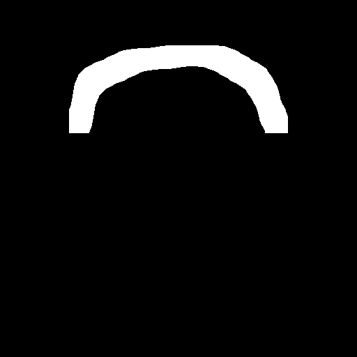
  

